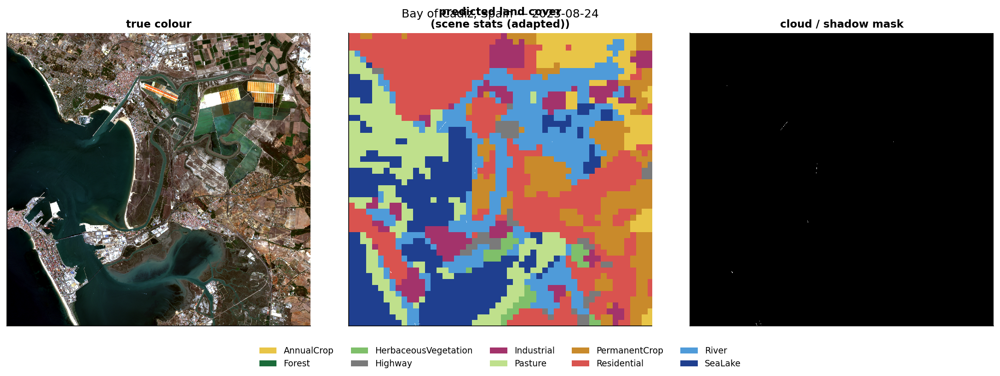
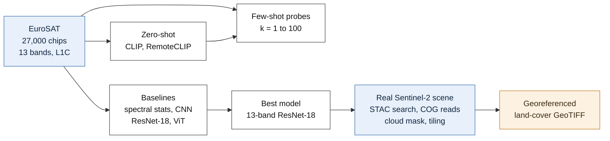
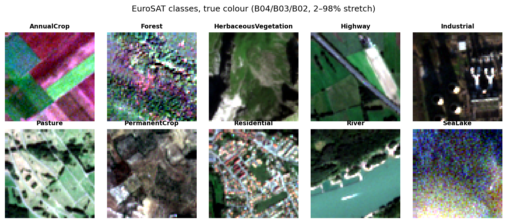
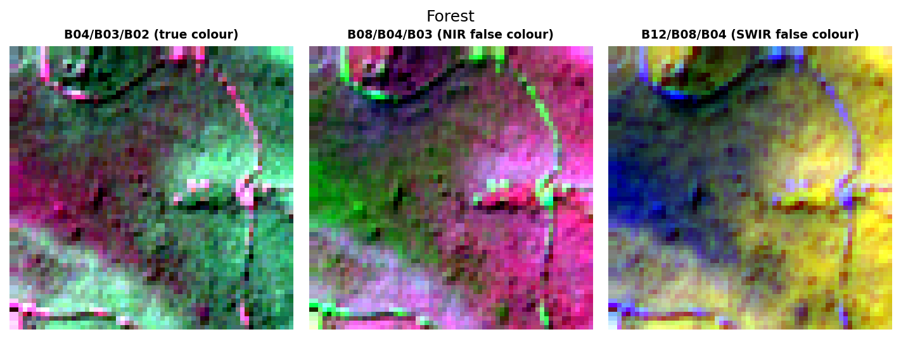
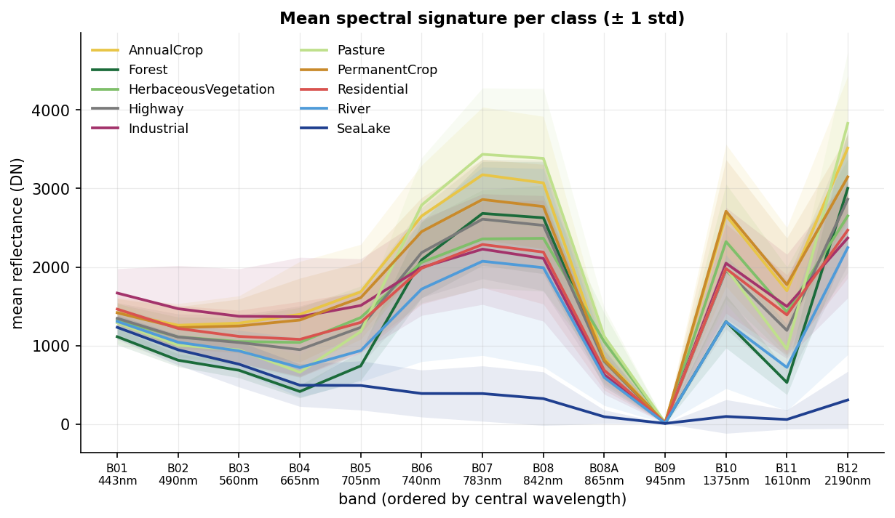
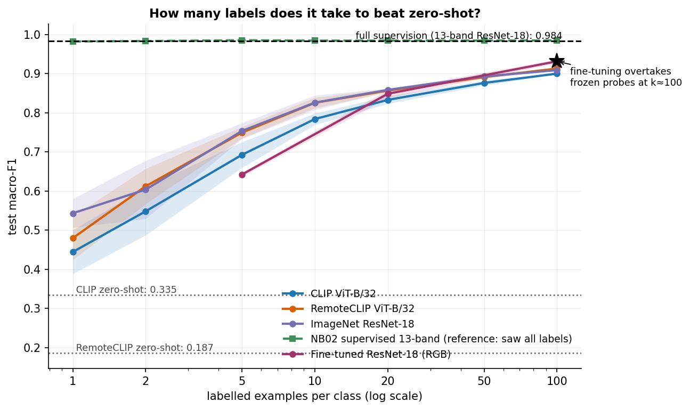
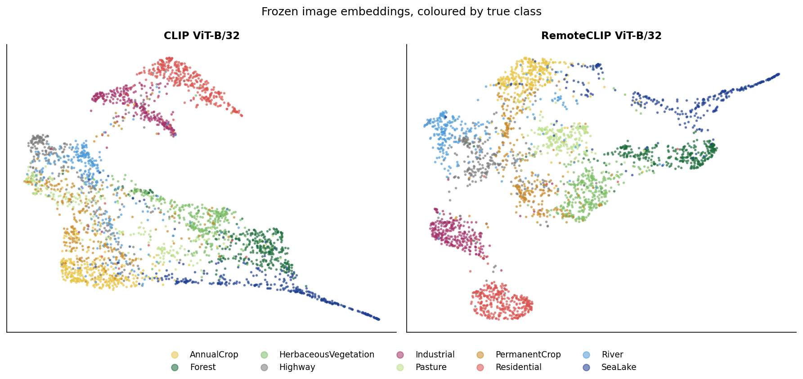
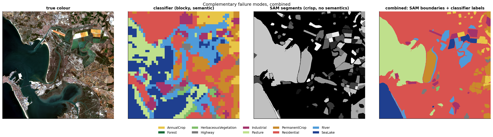
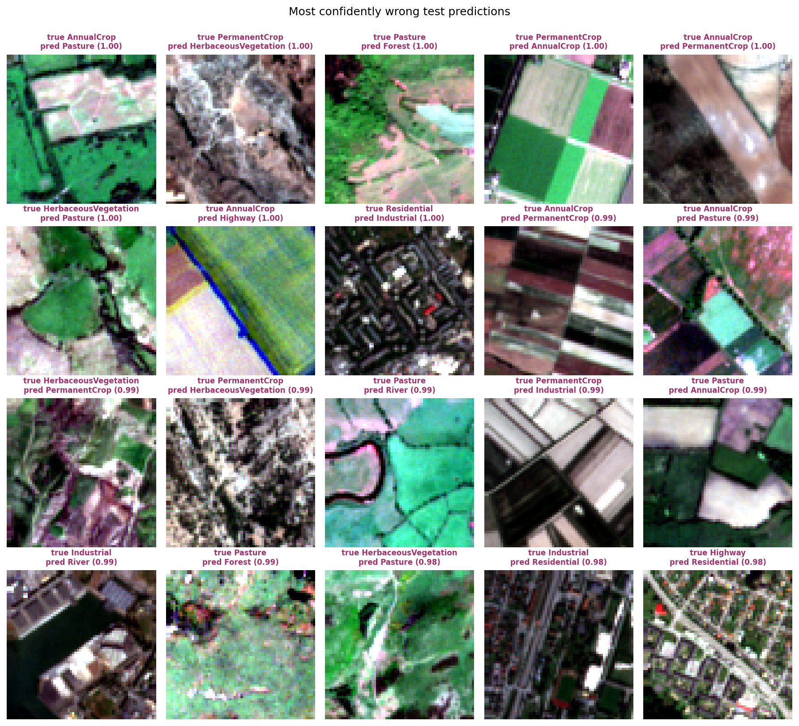

<div align="center">

# Sentinel-2 Land Cover: From Chips to Map

**Classifying satellite land cover with as few labels as possible — and turning it into a real map.**

[](https://www.python.org/)
[](https://pytorch.org/)
[](https://sentinels.copernicus.eu/web/sentinel/missions/sentinel-2)
[](tests/)
[](LICENSE)



<sub>A real Sentinel-2 scene over the Bay of Cádiz, Spain, classified end to end into a georeferenced
GeoTIFF. Left: true colour. Centre: predicted land cover. Right: the cloud mask marking which pixels
to disbelieve.</sub>

</div>

---

## What this is

A computer-vision project on **27,000 multispectral Sentinel-2 satellite chips** (13 spectral bands,
10 land-cover classes) that answers one question: **how few labels can you get away with?**

It compares label-free vision-language models (CLIP, RemoteCLIP) against few-shot probes and full
supervision, then takes the best model out of the benchmark and runs it on real satellite imagery —
fetching the scene from a public catalogue, masking clouds, and writing a map file that opens in QGIS.

---

## Results

<!-- AUTOGENERATED:headline -->
| Approach | Input | Labels used | Test macro-F1 |
|:---|:---|---:|---:|
| **No labels** | | | |
| CLIP ViT-B/32 — zero-shot | RGB (3 of 13 bands) | **0** | 0.359 |
| RemoteCLIP ViT-B/32 — zero-shot | RGB (3 of 13 bands) | **0** | 0.224 |
| **A handful of labels** | | | |
| Linear probe on frozen ImageNet ResNet-18 | RGB (3 of 13 bands) | 1 / class (10) | 0.543 ± 0.037 |
| Linear probe on frozen ImageNet ResNet-18 | RGB (3 of 13 bands) | 10 / class (100) | 0.826 ± 0.019 |
| Linear probe on frozen RemoteCLIP ViT-B/32 | RGB (3 of 13 bands) | 100 / class (1,000) | 0.913 ± 0.004 |
| Fine-tuned ResNet-18 | RGB (3 of 13 bands) | 100 / class (1,000) | 0.931 ± 0.004 |
| **Full supervision** | | | |
| Random Forest on 29 spectral statistics | 13-band summary stats | 18,900 | 0.891 |
| Small CNN, trained from scratch | 13-band | 18,900 | 0.970 ± 0.002 |
| ResNet-18, ImageNet-pretrained | RGB (3 of 13 bands) | 18,900 | 0.979 ± 0.001 |
| ViT-S/16, ImageNet-pretrained | 13-band | 18,900 | 0.980 ± 0.001 |
| **ResNet-18, ImageNet-pretrained, inflated stem** | **13-band** | **18,900** | **0.984 ± 0.002** |
| **Corrected for leakage** | | | |
| Same ResNet-18, scene-blocked split | 13-band | 18,900 | 0.964 |
<!-- END:headline -->

<sub>Test macro-F1 on a held-out set of 4,050 chips, mean ± std over 3 seeds (supervised) or 5 random
label draws (few-shot). Few-shot rows show the strongest encoder at each budget. Generated from
`outputs/results.json` — no number here is typed by hand.</sub>

**Read the table top to bottom and the whole project is in it:** zero-shot vision-language models
reach 0.36, *one* labelled example per class already beats them, 1,000 labels reach 93 % of the
achievable score, and full supervision tops out at 0.984 — of which 0.021 turns out to be
train/test leakage.

---

## Five things it found

**1. Most of the problem is spectroscopy, not deep learning.** Twenty-nine hand-made spectral
statistics with *all* spatial structure deleted reach 0.891. The entire deep-learning stack adds 9.5
points on top of that.

**2. One labelled example per class beats zero-shot.** Every frozen encoder at k=1 (0.44–0.54)
exceeds zero-shot CLIP (0.359). Frozen probes beat fine-tuning below ~100 labels per class, where
updating 11 M parameters on a few dozen examples simply overfits.

**3. RemoteCLIP has better features but worse language alignment than generic CLIP.** It loses
zero-shot (−0.135) and wins as a frozen feature extractor (+0.080). Replacing its text prototypes
with image class-means isolates the cause: the encoder improved, the text alignment degraded. Its ten
class text embeddings sit at 0.88 mean pairwise cosine similarity — crowded into nearly one
direction, so the prediction is decided by noise.

**4. Real imagery breaks assumptions the benchmark hides.** Training data is Level-1C
(top-of-atmosphere) and real scenes are Level-2A (surface reflectance). The two defensible
normalisation choices disagree on **65 % of pixels** — same weights, same pixels. Model confidence
falls from 0.991 on benchmark chips to 0.729 on the real scene.

**5. Two of my own claims did not survive error bars.** Multispectral-over-RGB (+0.005) and
pretrained-stem-over-random (+0.001) both fall inside seed noise at three seeds, and are retracted.
Separately, clustering chips by atmospheric bands as a proxy for "photographed the same day" and
holding whole clusters out shows **2.1 points of the headline number was leakage**.

---

## How it works



Seven notebooks, in order: [data and spectral analysis](notebooks/01_data_and_spectral_eda.ipynb) ·
[supervised baselines](notebooks/02_supervised_baselines.ipynb) ·
[zero-shot CLIP](notebooks/03_zeroshot_clip.ipynb) ·
[label efficiency](notebooks/04_fewshot_label_efficiency.ipynb) ·
[chips to map](notebooks/05_chips_to_map.ipynb) ·
[explainability and calibration](notebooks/06_explainability_and_failures.ipynb) ·
[verification](notebooks/07_verification_and_ablations.ipynb)

---

## The data

<div align="center">

</div>

Ten classes, one chip each, in true colour. Every chip is 64 × 64 pixels at 10 m per pixel, so each
covers **640 × 640 m of ground**. Rendering them requires a 2–98 % percentile stretch — raw satellite
values render almost black, because land reflectance occupies a small, low slice of the sensor's
range.

<div align="center">

</div>

The same forest chip, three ways. Sentinel-2 measures **13 wavelengths, not 3**. Feeding the
near-infrared band into the display's red channel (centre) makes healthy vegetation glow: chlorophyll
absorbs red light while leaf structure scatters infrared strongly. The shortwave-infrared composite
(right) tracks moisture and bare ground. This is the information a photograph-trained model cannot
see — and the reason CLIP is handicapped here, since it only accepts RGB.

<div align="center">

</div>

Average reflectance per band for each class — the physical reason classification works at all. Three
families: **vegetation** shares the red edge (dip at B04, jump at B08) and differs only in amplitude;
**water** collapses to near zero past 900 nm; **built-up** is flat and bright. From this plot alone,
before training anything, I predicted the model would confuse the vegetation classes with each other
and nail water. It did — 54 % of its errors are vegetation-internal, and water scores 0.998.

---

## Label efficiency — the headline result

<div align="center">

</div>

Macro-F1 against labelling budget (log scale), shaded by ±1 std over **five independent random label
draws** per point. Dotted lines are zero-shot; the dashed line is full supervision on 18,900 labels.

The k=1 error bars are wider than the gaps between encoders — which is exactly why one-shot results
must be reported over multiple draws, not once.

<!-- AUTOGENERATED:label_efficiency -->
| Frozen encoder | **k=1** | **k=2** | **k=5** | **k=10** | **k=20** | **k=50** | **k=100** |
|:---|---:|---:|---:|---:|---:|---:|---:|
| CLIP ViT-B/32 | 0.444 | 0.548 | 0.692 | 0.784 | 0.833 | 0.876 | 0.900 |
| RemoteCLIP ViT-B/32 | 0.479 | 0.612 | 0.749 | 0.825 | 0.857 | 0.891 | 0.913 |
| ImageNet ResNet-18 | 0.543 | 0.604 | 0.754 | 0.826 | 0.858 | 0.893 | 0.909 |
| Fine-tuned ResNet-18 (RGB) | — | — | 0.642 | — | 0.848 | — | 0.931 |
<!-- END:label_efficiency -->

<div align="center">

</div>

Frozen image embeddings of 3,000 test chips projected to 2-D and coloured by true class. **The
clusters are far cleaner than the zero-shot scores (0.36 / 0.22) suggest** — the image encoders
understand the imagery; it is the *text* prototypes that are misplaced. That observation is what
motivated the few-shot probes, and it was confirmed directly by swapping text prototypes for image
class-means.

---

## From chips to a real map

<div align="center">

</div>

The chip classifier produces semantics with boundaries quantised to the 64-pixel tile grid; **Segment
Anything** produces crisp object outlines with no idea what anything is. They fail in complementary
ways, so assigning each SAM segment the majority class predicted inside it gives crisp boundaries
*and* labels — no training, no new model.

Getting here required the parts that make this geospatial rather than image processing: a **STAC**
catalogue search for a low-cloud scene, **windowed Cloud-Optimised GeoTIFF reads** (a few megabytes
instead of a few hundred), resampling six bands from 20 m onto the 10 m grid, masking cloud and
shadow, sliding-window inference with 50 % overlap to avoid tile seams, and writing the result with
its coordinate system intact so it opens in QGIS and areas can be computed in hectares.

<!-- AUTOGENERATED:scene -->
Scene `S2B_29SQA_20230824_0_L2A` — 2023-08-24, 0.01 % cloud. Largest predicted classes: Residential 6,724 ha, SeaLake 4,700 ha, River 4,452 ha, Pasture 3,215 ha. The two defensible normalisation choices disagree on **65.1%** of valid pixels.
<!-- END:scene -->

<div align="center">

</div>

The twenty most confident *mistakes*. Nearly all are vegetation-versus-vegetation at ≥ 0.98
confidence, and several are genuinely ambiguous: a 640 m square routinely contains a road *and*
houses *and* a field, so a single label is sometimes simply wrong. If roughly a quarter of confident
errors are label noise, then 0.984 is closer to a **dataset** ceiling than a model ceiling — and the
useful next step is better labels, not a bigger network.

---

## Limitations

- **The random split leaks**, measured at −0.021 macro-F1. EuroSAT gives no scene identifiers, so a
  geographically blocked split is impossible; chips were clustered by atmospheric bands as a proxy.
- **Trained on L1C, deployed on L2A.** Re-standardising with scene statistics patches a global offset
  but cannot fix a change in distribution shape. The proper fix is to train on the level you deploy on.
- **EuroSAT is small, European and single-label**, and 640 m chips routinely contain several land
  covers. Nothing here supports a cross-continental generalisation claim.
- **Discarding 10 of 13 bands to feed CLIP is structural**, not a tuning problem.
- **No temporal dimension** — every result uses a single date, while land cover is seasonal.
- **The map has no ground truth**; the ESA WorldCover comparison (42.8 % agreement) is an agreement
  analysis between two models, not an accuracy evaluation.

---

## Run it

Every notebook runs top to bottom on a free Colab T4 and persists its outputs to Google Drive.

| Notebook | Runtime | |
|:---|---:|---|
| 01 Data and spectral analysis | ~10 min | [](https://colab.research.google.com/github/SaadH-077/sentinel2-landcover-mapping/blob/main/notebooks/01_data_and_spectral_eda.ipynb) |
| 02 Supervised baselines | ~35 min | [](https://colab.research.google.com/github/SaadH-077/sentinel2-landcover-mapping/blob/main/notebooks/02_supervised_baselines.ipynb) |
| 03 Zero-shot CLIP | ~20 min | [](https://colab.research.google.com/github/SaadH-077/sentinel2-landcover-mapping/blob/main/notebooks/03_zeroshot_clip.ipynb) |
| 04 Label efficiency | ~30 min | [](https://colab.research.google.com/github/SaadH-077/sentinel2-landcover-mapping/blob/main/notebooks/04_fewshot_label_efficiency.ipynb) |
| 05 Chips to map | ~40 min | [](https://colab.research.google.com/github/SaadH-077/sentinel2-landcover-mapping/blob/main/notebooks/05_chips_to_map.ipynb) |
| 06 Explainability and calibration | ~20 min | [](https://colab.research.google.com/github/SaadH-077/sentinel2-landcover-mapping/blob/main/notebooks/06_explainability_and_failures.ipynb) |
| 07 Verification | ~50 min | [](https://colab.research.google.com/github/SaadH-077/sentinel2-landcover-mapping/blob/main/notebooks/07_verification_and_ablations.ipynb) |

```bash
make install    # pinned dependencies
make test       # 60 tests — seconds, no GPU or data download needed
make readme     # regenerate the result tables from outputs/results.json
```

---

## Code

```
src/s2map/     shared library — the notebooks import it and never redefine it
  bands.py       band table, spectral indices, compositing, band-order checks
  data.py        dataset loading with fallbacks, splits, normalisation
  models.py      backbones, 13-channel stem inflation, Grad-CAM, band masking
  train.py       one training loop for every arm
  evaluate.py    metrics, calibration, the results ledger
  clip_utils.py  prompt strategies, zero-shot heads, RemoteCLIP loading
  stac.py        catalogue search, windowed COG reads, cloud masking
  inference.py   sliding-window tiling and stitching, GeoTIFF output
tests/         60 tests targeting failures that change results without erroring:
               split leakage, tile-seam averaging, band-order permutation,
               metric correctness, and two real bugs — a frozen encoder disabling
               autograd globally, and Grad-CAM hooks substituting tensors
```

---

## Credits

**EuroSAT** (Helber et al., IEEE JSTARS 2019, MIT) · **Copernicus Sentinel-2** via the
[AWS Earth Search STAC API](https://earth-search.aws.element84.com/v1) · **ESA WorldCover 2021**
(CC-BY 4.0) · **RemoteCLIP** ([Liu et al., IEEE TGRS 2024](https://github.com/ChenDelong1999/RemoteCLIP)) ·
**Segment Anything** (Kirillov et al., ICCV 2023) via
[segment-geospatial](https://github.com/opengeos/segment-geospatial) ·
**CLIP** (Radford et al., 2021) · calibration method from Guo et al., 2017

No imagery is committed to this repository; everything downloads at run time.

<div align="center">
<sub>MIT licensed &nbsp;·&nbsp; Built by <b>Muhammad Saad Haroon</b></sub>
</div>
