<div align="center">

# Sentinel-2 Land Cover: From Chips to Map

**How far can satellite land cover be classified *without labels* using vision-language models,
and how many labels does it take to beat them?**

[](https://www.python.org/)
[](https://pytorch.org/)
[](https://sentinels.copernicus.eu/web/sentinel/missions/sentinel-2)
[](notebooks/)
[](tests/)
[](LICENSE)


<sub><b>The end of the pipeline.</b> A real Sentinel-2 Level-2A scene over the Bay of Cádiz, Spain
(2023-08-24, 0.01 % cloud), classified by sliding-window inference into a georeferenced GeoTIFF.
Left: true colour. Centre: predicted land cover. Right: the cloud and shadow mask that marks which
pixels to disbelieve.</sub>

</div>

---

## Contents

| | |
|---|---|
| [1. Overview](#1-overview) | What the project is and what it concludes |
| [2. System architecture](#2-system-architecture) | Components, and what depends on what |
| [3. Data flow](#3-data-flow-between-chapters) | How the seven chapters hand work to each other |
| [4. The data and its physics](#4-the-data-and-its-physics) | Chapter 01 |
| [5. Supervised baselines](#5-supervised-baselines) | Chapter 02 |
| [6. Zero-shot vision-language models](#6-zero-shot-vision-language-models) | Chapter 03 |
| [7. Label efficiency](#7-label-efficiency) | Chapter 04 — the headline result |
| [8. From chips to a map](#8-from-chips-to-a-map) | Chapter 05 |
| [9. Trustworthiness](#9-trustworthiness) | Chapter 06 |
| [10. Verification](#10-verification) | Chapter 07 |
| [11. Results](#11-results) | Every recorded metric |
| [12. Findings](#12-findings) | Eight claims, with numbers |
| [13. Limitations](#13-limitations) | Written by the author |
| [14. Reproduce it](#14-reproduce-it) | Colab and local |
| [15. Engineering](#15-engineering) | Library layout and tests |
| [16. Data and credits](#16-data-and-credits) | Sources, licences, references |

---

## 1. Overview

This is a seven-chapter computer-vision study on **27,000 multispectral Sentinel-2 chips** that ends
by producing a georeferenced land-cover map of a real satellite scene. It moves deliberately up a
ladder — spectral statistics, a small CNN, a pretrained ResNet, a Vision Transformer, CLIP and
RemoteCLIP, few-shot probes, promptable segmentation — so that every result has something to be
measured against.

The five numbers that summarise it:

| Result | Value | Chapter |
|---|---|---|
| Full supervision, 13-band ResNet-18, 18,900 labels (3 seeds) | **0.984** macro-F1 | 02 |
| Best zero-shot CLIP — no labels, 10 of 13 bands discarded | **0.359** macro-F1 | 03, 07 |
| Labels per class needed to beat zero-shot with a linear probe | **1** | 04 |
| Spectral statistics and a Random Forest, no deep learning | **0.891** macro-F1 | 02 |
| Cost of removing train/test leakage via a scene-blocked split | **−0.021** macro-F1 | 07 |

> **The conclusion in one sentence.** A single labelled example per class already beats zero-shot
> CLIP; one hundred labels per class — five per cent of the training set — comes within five points
> of full supervision; and eighty-nine per cent of the problem is solved by spectral statistics
> alone, before any deep learning is applied.

---

## 2. System architecture

Every piece of logic lives in the `s2map` library; the notebooks are thin consumers that compose it
and record results. Nothing is defined twice. The diagram below shows what exists and what depends
on what.

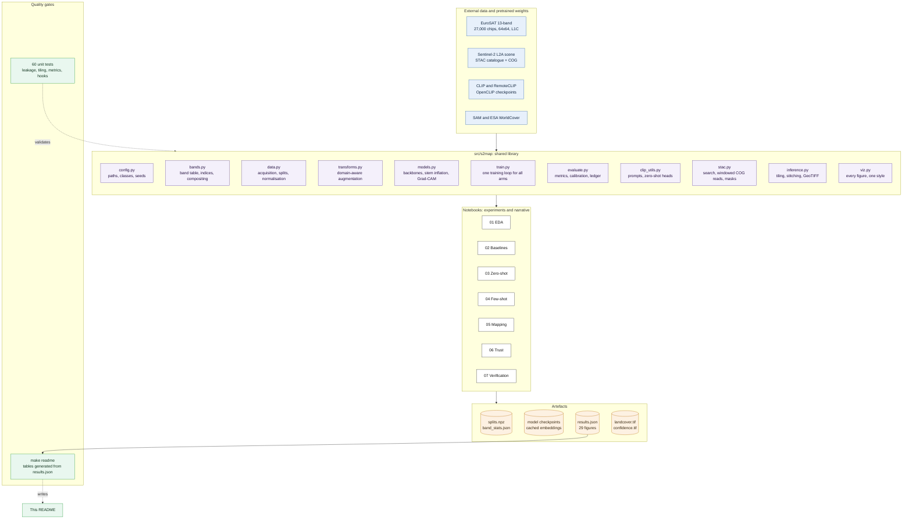

| Module | Responsibility | Used by |
|---|---|---|
| `config.py` | Paths, class names and colours, seeds, experiment config, environment checks | all |
| `bands.py` | Sentinel-2 band table, NDVI/NDWI/NDBI, percentile stretch, composites, band-order verification | 01, 02, 05, 06 |
| `data.py` | Dataset acquisition with four documented fallbacks, stratified splits, leakage-free normalisation | all |
| `transforms.py` | Dihedral augmentation and illumination jitter — chosen for overhead imagery, not copied from ImageNet | 02, 04, 07 |
| `models.py` | ResNet/ViT/CNN builders, 13-channel stem inflation, band masking, Grad-CAM | 02, 04, 05, 06, 07 |
| `train.py` | One training loop for every arm: AdamW, cosine schedule with warmup, AMP, early stopping | 02, 04, 07 |
| `evaluate.py` | Metrics, confusion structure, ECE, temperature scaling, the results ledger | all |
| `clip_utils.py` | Prompt strategies, zero-shot classifier heads, RemoteCLIP loading | 03, 04, 07 |
| `stac.py` | STAC search, windowed Cloud-Optimised GeoTIFF reads, SCL cloud masking | 05 |
| `inference.py` | Sliding-window tiling and stitching, GeoTIFF writing, SAM segment fusion | 05 |
| `viz.py` | Every figure in the project, in one consistent style | all |

---

## 3. Data flow between chapters

The architecture above shows what exists. This shows the order it runs in, and why the chapters
cannot be reordered: the cylinders are the contract between them.

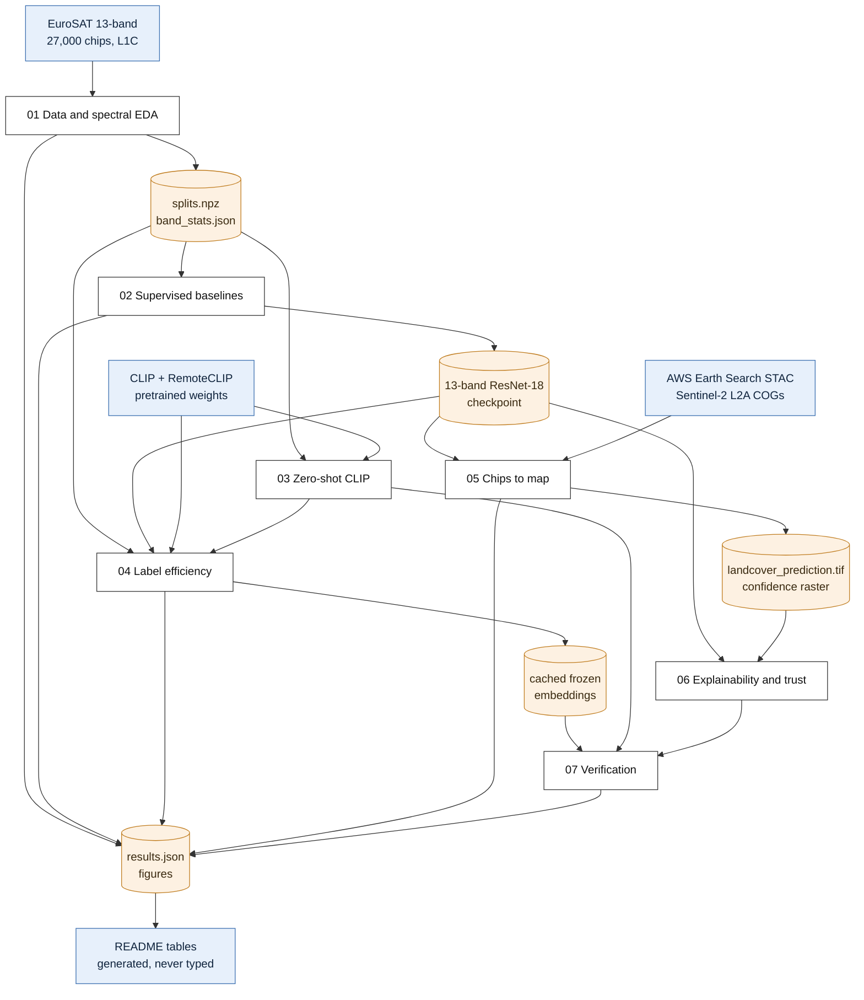

Chapter 01 writes the one split every later chapter uses; 02 writes the checkpoint that 04, 05 and 06
load; 03 writes the zero-shot anchors that 04 plots. Each notebook fails loudly if a prerequisite is
missing rather than silently rebuilding it differently — which is also why a lost Colab session never
costs more than one chapter.

---

## 4. The data and its physics

*Chapter 01 — [`01_data_and_spectral_eda.ipynb`](notebooks/01_data_and_spectral_eda.ipynb)*

A satellite image is not a photograph. Each pixel is thirteen calibrated measurements of reflected
sunlight, from 443 nm to 2190 nm. This chapter establishes what is physically measurable before any
model is trained — and generates a testable prediction about which classes will confuse.

### 4.1 Why raw satellite imagery renders black

<div align="center">
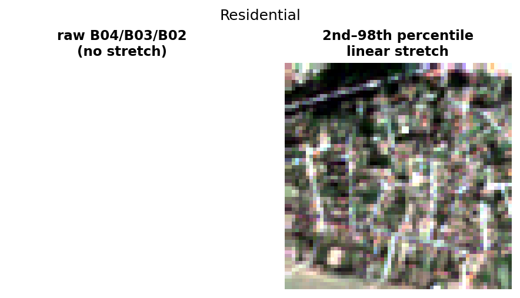
</div>

Surface reflectance over land occupies a small, low portion of the sensor's dynamic range, so
rendering raw values maps the entire scene into the darkest few per cent of the display. A linear
stretch between the 2nd and 98th percentiles of each band recovers the image. Applied per band, it
also removes the blue cast that Rayleigh scattering places on every uncorrected optical image. This
is a display transform only — the arrays the models receive keep their physical units.

### 4.2 The ten classes

<div align="center">

</div>

One chip per class in true colour (B04/B03/B02). Each covers 640 × 640 m at 10 m resolution. Note how
little visually separates `Residential` from `Industrial`, and how similar the four vegetation classes
appear — a similarity the spectral analysis below turns into a quantitative prediction.

### 4.3 What the non-visible bands reveal

<div align="center">

<br/>

</div>

The same chip rendered three ways. In the **NIR composite** (B08/B04/B03) healthy vegetation appears
vivid red, because chlorophyll absorbs red light while the internal structure of leaves scatters
near-infrared strongly. In the **SWIR composite** (B12/B08/B04), shortwave infrared is absorbed by
water, so moisture, bare ground and built surfaces separate clearly. These are the bands a
photograph-trained model cannot see.

### 4.4 Spectral signatures — the key figure of the chapter

<div align="center">

</div>

Mean reflectance across all thirteen bands for each class, with ±1 standard deviation shaded. Three
families are visible. **Vegetation** classes share the red edge — a dip at B04 where chlorophyll
absorbs, and a sharp rise into B08 — and differ from one another mainly in amplitude. **Water**
collapses towards zero beyond 900 nm, because liquid water absorbs almost all infrared radiation.
**Built-up** surfaces are spectrally flat and bright, having no chlorophyll at all.

**The prediction this generated,** written before any model was trained: the dominant confusions
would be *within* the vegetation group, water would be near-perfect, and linear features would suffer
from the 640 m chip size. Chapters 02 and 06 scored it — two of the three held.

### 4.5 Physics-derived features that need no training

<div align="center">
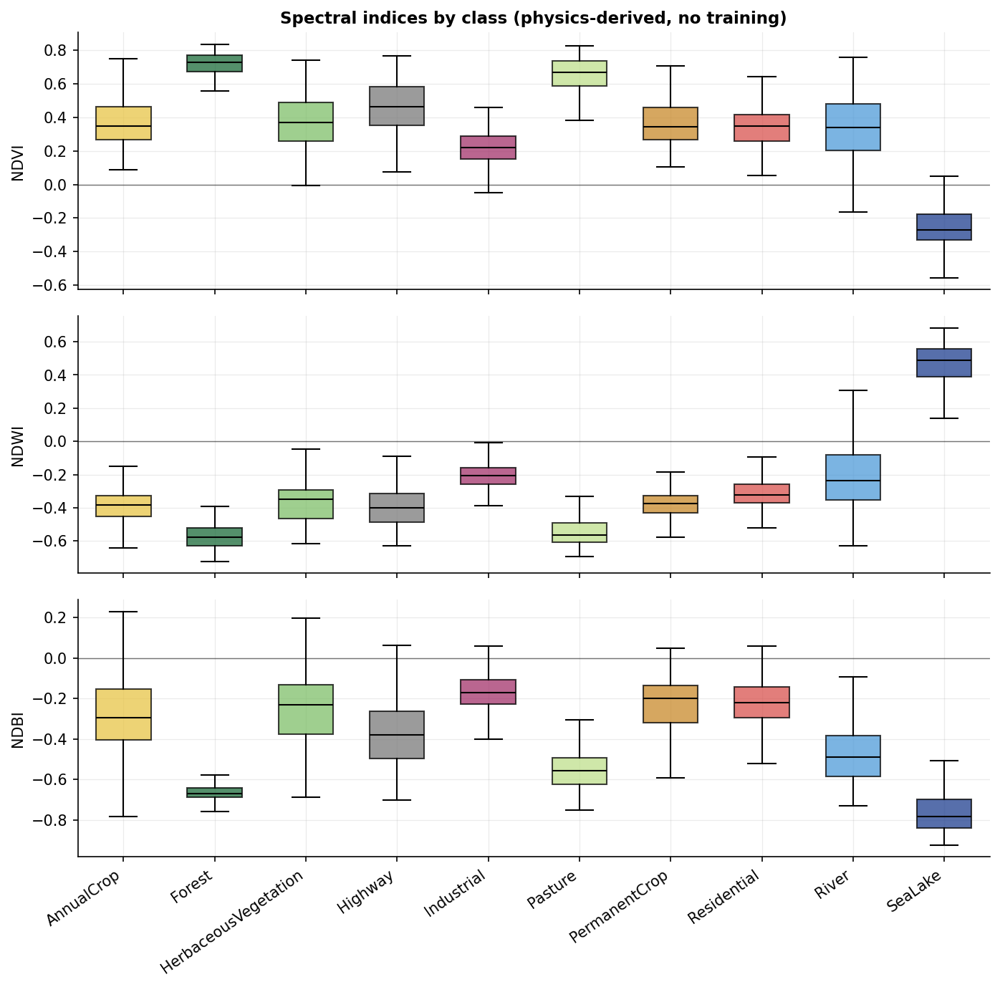
</div>

Three normalised band ratios: NDVI (vegetation vigour), NDWI (open water), NDBI (built-up surfaces).
Being ratios, they cancel multiplicative effects such as illumination angle. The measured NDVI
ordering runs `SeaLake < Industrial < Residential < River < … < Pasture < Forest` — exactly the
physical ordering, recovered with zero parameters and zero labels. These are the lowest rung of the
model ladder, and chapter 02 measures how far they alone get you.

---

## 5. Supervised baselines

*Chapter 02 — [`02_supervised_baselines.ipynb`](notebooks/02_supervised_baselines.ipynb)*

Four arms in a deliberate order, because the order is the argument: classical features, a small CNN,
a pretrained ResNet-18, and a Vision Transformer. Every trained arm is reported as mean ± std over
three seeds.

### 5.1 The ladder

<div align="center">
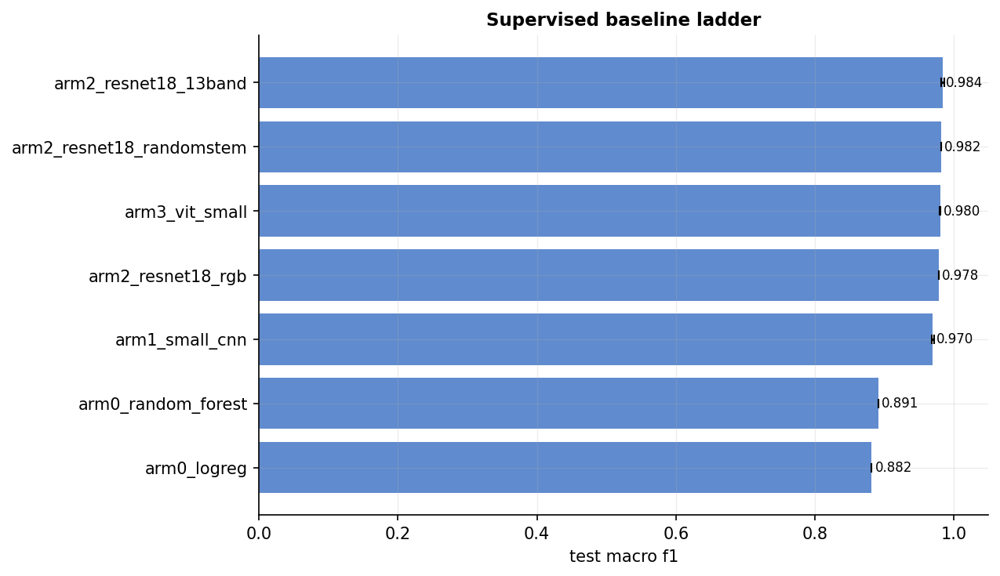
</div>

Twenty-nine hand-made spectral statistics with **all** spatial structure discarded reach 0.891
macro-F1. The entire deep-learning stack adds 9.5 points on top of that. The ViT does not beat the
ResNet — expected at this data scale, and reported as measured rather than tuned until it looked
better.

### 5.2 What the Random Forest keys on

<div align="center">
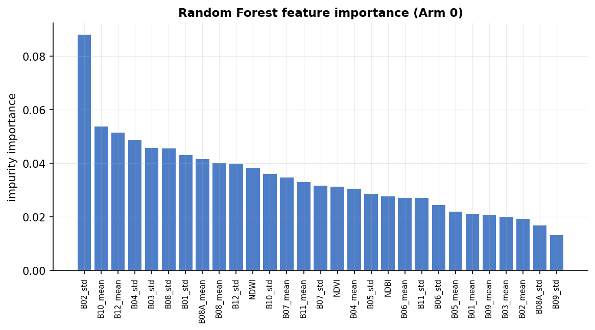
</div>

The top feature is `B02_std` — the *variance* of the blue band, a texture measure rather than a
brightness one. The second is `B10_mean`, the **cirrus band**, which carries almost no surface
information. That anomaly is the first hint of the leakage that chapter 07 goes on to quantify.

### 5.3 Where the best model fails

<div align="center">
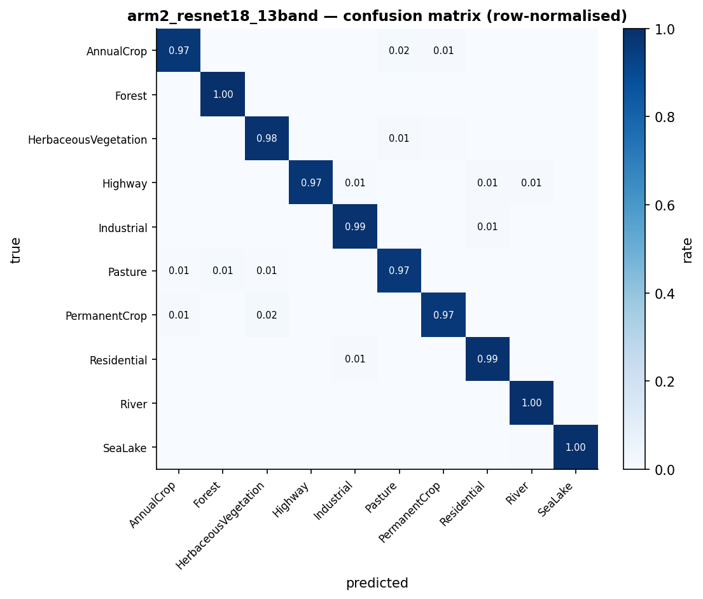
</div>

Row-normalised confusion matrix for the 13-band ResNet-18 (0.984 macro-F1). The errors concentrate
exactly where chapter 01 predicted: `PermanentCrop ↔ HerbaceousVegetation`, `AnnualCrop ↔ Pasture`.
Water is essentially solved at 0.998 and 0.989 F1.

---

## 6. Zero-shot vision-language models

*Chapter 03 — [`03_zeroshot_clip.ipynb`](notebooks/03_zeroshot_clip.ipynb)*

CLIP places images and captions in one shared embedding space, so a classifier can be built with no
labels at all: encode a text prompt per class, encode the image, take the nearest class. The cost of
doing this on satellite data is severe — CLIP consumes 3-channel RGB, so **ten of the thirteen bands
must be discarded**, including every band chapter 01 showed to carry the separability.

### 6.1 Per-class zero-shot performance

<div align="center">
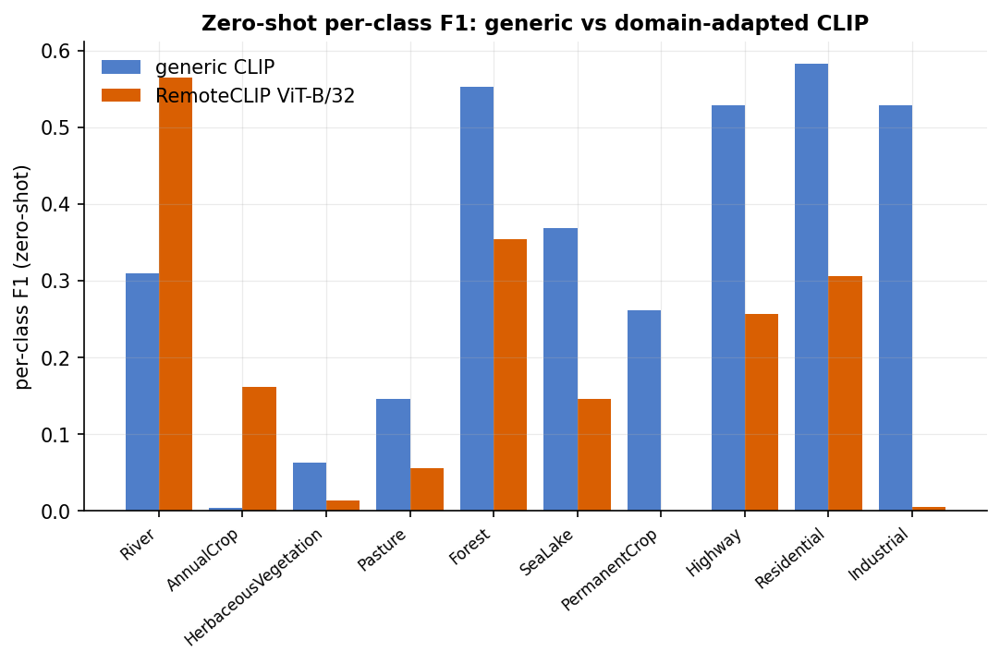
</div>

Generic CLIP reaches 0.359 macro-F1 with its best prompt strategy; the remote-sensing-adapted
RemoteCLIP reaches only 0.224. That ordering is the opposite of what domain-specific pretraining is
supposed to produce, and it is the reason chapter 07 exists.

### 6.2 The embedding space

<div align="center">

</div>

UMAP projection of frozen image embeddings for 3,000 test chips, coloured by true class. **The
clusters are far cleaner than the zero-shot accuracy suggests.** That gap between a well-structured
representation and a poor zero-shot score is the central observation of the chapter: the image
encoder is doing its job, and the text prototypes are landing in the wrong places. It is also the
direct motivation for the linear probes of chapter 04, and the hypothesis that chapter 07 tests
explicitly.

### 6.3 Confidently wrong predictions

<div align="center">
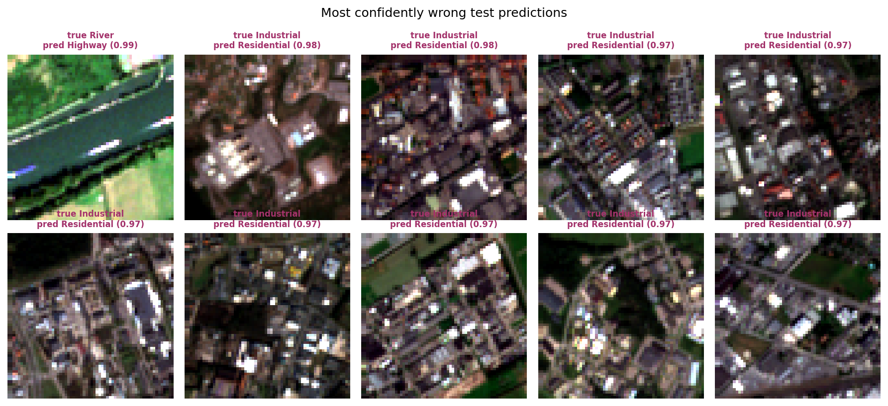
</div>

CLIP's ten most confident mistakes. Many are chips whose RGB rendering is genuinely ambiguous to a
human — which is a different failure from a model that has simply never seen overhead imagery.

---

## 7. Label efficiency

*Chapter 04 — [`04_fewshot_label_efficiency.ipynb`](notebooks/04_fewshot_label_efficiency.ipynb)*

This chapter converts a model comparison into the question a manager actually asks: *how many labels
must we buy to enter a new problem?*

<div align="center">

</div>

Test macro-F1 against labelling budget on a logarithmic axis, with ±1 standard deviation over **five
independent random label draws per point**. Dotted lines mark zero-shot (0 labels); the dashed line
marks full supervision (18,900 labels). The encoder trained on the full training set is drawn dashed
and labelled as an upper reference, not as a competitor.

Three things to read from it. First, **the k = 1 error bars are wider than the gaps between
encoders** — a single one-shot number would be reporting the draw, not the model. Second, **every
encoder at k = 1 already exceeds zero-shot CLIP**. Third, the curves are still climbing at k = 100,
where the best frozen probe reaches 0.913 against a 0.984 ceiling.

<!-- AUTOGENERATED:label_efficiency -->
| Frozen encoder | k=1 | k=2 | k=5 | k=10 | k=20 | k=50 | k=100 |
|---|---|---|---|---|---|---|---|
| CLIP ViT-B/32 | 0.444 ± 0.056 | 0.548 ± 0.061 | 0.692 ± 0.033 | 0.784 ± 0.015 | 0.833 ± 0.010 | 0.876 ± 0.006 | 0.900 ± 0.001 |
| RemoteCLIP ViT-B/32 | 0.479 ± 0.056 | 0.612 ± 0.045 | 0.749 ± 0.015 | 0.825 ± 0.013 | 0.857 ± 0.004 | 0.891 ± 0.003 | 0.913 ± 0.004 |
| ImageNet ResNet-18 | 0.543 ± 0.037 | 0.604 ± 0.074 | 0.754 ± 0.020 | 0.826 ± 0.019 | 0.858 ± 0.004 | 0.893 ± 0.005 | 0.909 ± 0.001 |
| NB02 supervised 13-band *(reference — saw all labels)* | 0.982 ± 0.001 | 0.983 ± 0.001 | 0.985 ± 0.001 | 0.984 ± 0.001 | 0.984 ± 0.001 | 0.984 ± 0.001 | 0.984 ± 0.000 |
| Fine-tuned ResNet-18 (RGB) | 0.642 ± 0.005 | 0.848 ± 0.010 | 0.931 ± 0.004 |

Full-supervision ceiling (all 18,900 training labels): **0.984** macro-F1.  
CLIP zero-shot (0 labels): **0.335** macro-F1.  
RemoteCLIP zero-shot (0 labels): **0.187** macro-F1.  
Fine-tuning overtakes every frozen probe at roughly **k = 100** labels per class.
<!-- END:label_efficiency -->

---

## 8. From chips to a map

*Chapter 05 — [`05_chips_to_map.ipynb`](notebooks/05_chips_to_map.ipynb)*

Everything up to this point used a curated benchmark. This chapter fetches real imagery through a
STAC catalogue, reads only the required window of each Cloud-Optimised GeoTIFF, handles clouds and
mixed resolutions, and writes a georeferenced map.

### 8.1 The scene and its cloud mask

<div align="center">
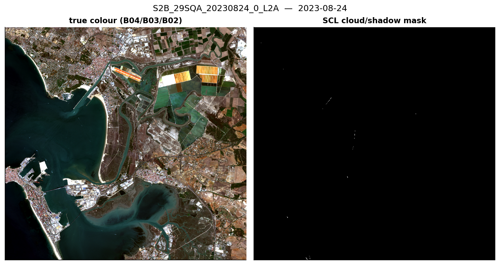
</div>

A ~15 × 15 km window over the Bay of Cádiz: open sea, tidal marsh, a river channel, farmland, dense
housing and an industrial port. Cloud and shadow come from the Scene Classification Layer shipped
with every L2A product. Masked pixels are written as nodata rather than assigned a class — predicting
land cover beneath a cloud is a guess about the cloud.

### 8.2 The domain shift, measured

<div align="center">

</div>

EuroSAT is Level-1C (top-of-atmosphere reflectance); the fetched scene is Level-2A (surface
reflectance, atmospherically corrected). The same units, and visibly different distributions. The
practical consequence is measured rather than asserted: the two defensible normalisation
choices — training statistics versus scene statistics — **disagree on 65.1 % of valid pixels**, from
identical weights on identical imagery. Nothing raises an error; the map simply changes.

### 8.3 Segmentation without semantics, and semantics without boundaries

<div align="center">

</div>

Two models that fail in exactly complementary ways. The chip classifier produces semantics with
boundaries quantised to the 64 × 64 tile grid; Segment Anything produces crisp, object-aligned
segments with no idea what any of them are. Assigning each SAM segment the majority class predicted
inside it yields crisp boundaries *and* labels, with no training and no new model. Without ground
truth we report the disagreement rate rather than claiming an improvement — the result is sharper,
not provably more accurate.

### 8.4 Agreement with an independent product

<div align="center">

</div>

ESA WorldCover is another model's product, not ground truth, so this is an **agreement analysis, not
an accuracy evaluation** — a distinction worth being precise about. Overall agreement is 42.8 % after
a deliberately lossy class mapping (three built-up classes collapse into one). The area also contains
salt marsh and tidal flats, which have no EuroSAT class at all, and the model must nonetheless assign
one of its ten labels to every pixel.

<!-- AUTOGENERATED:scene -->
Scene: `S2B_29SQA_20230824_0_L2A` over Bay of Cadiz, Spain, 2023-08-24, 0.009914% cloud.

| Class | Predicted area (ha) |
|---|---|
| AnnualCrop | 1,564 |
| Forest | 0 |
| HerbaceousVegetation | 410 |
| Highway | 546 |
| Industrial | 1,775 |
| Pasture | 3,215 |
| PermanentCrop | 3,123 |
| Residential | 6,724 |
| River | 4,452 |
| SeaLake | 4,700 |
| _nodata | 3 |

The two normalisation choices (training statistics vs scene statistics) disagree on **65.1%** of valid pixels — identical weights, identical pixels, different preprocessing. That is the L1C→L2A domain shift, measured.
<!-- END:scene -->

---

## 9. Trustworthiness

*Chapter 06 — [`06_explainability_and_failures.ipynb`](notebooks/06_explainability_and_failures.ipynb)*

Most portfolio projects stop at an accuracy number. For a system anyone has to rely on, "the model
said so" is not an acceptable output.

### 9.1 Which parts of the spectrum the model actually needs

<div align="center">

</div>

Each band group is masked at inference — replaced by its training mean, meaning "no information"
rather than an impossible zero reflectance — and the macro-F1 drop is measured per class. Removing
the **visible** bands costs 0.330, SWIR 0.118, **atmospheric 0.076**, red-edge 0.064 and NIR 0.023.
This is a causal intervention, unlike the correlational forest importances of chapter 02, and the
atmospheric result is the anomaly chapter 07 pursues.

### 9.2 Grad-CAM, and its honest limits

<div align="center">
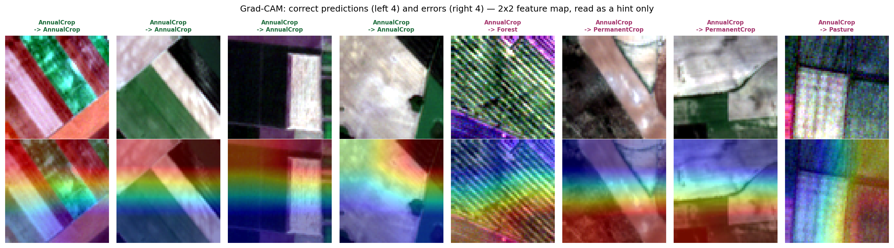
</div>

Grad-CAM for four correct predictions and four errors. **At 64 × 64 input with a stride-32 backbone
the final feature map is 2 × 2**, so these heatmaps are upsampled from four values. They are a weak
hint about which quadrant mattered, not a spatial explanation — stating that is more useful than
presenting a smooth heatmap that explains nothing. For this data, the band ablation above is the
meaningful attribution method.

### 9.3 Calibration

<div align="center">
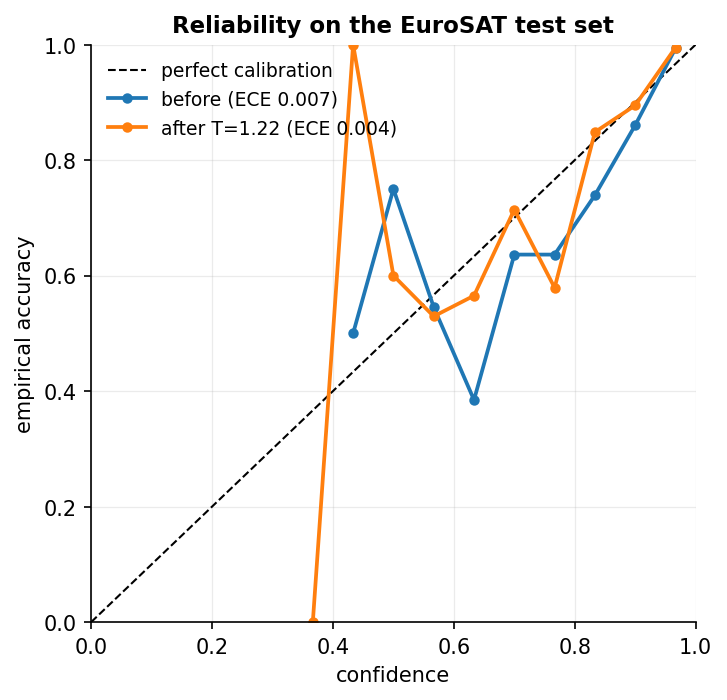
</div>

The model is mildly overconfident. Temperature scaling — one scalar, T = 1.224, fitted on the
validation set — reduces Expected Calibration Error from 0.0074 to 0.0041 while provably changing no
prediction, since a positive scalar cannot alter an argmax. This matters operationally: any deployed
system auto-accepts above a confidence threshold and routes the rest to a human, and that threshold
is meaningless if confidence is not calibrated.

### 9.4 Confidence collapses under domain shift

<div align="center">

</div>

Mean confidence is 0.991 on benchmark test chips, with 97.3 % of predictions above 0.9. On the real
L2A scene it falls to 0.729, with only 29.1 % above 0.9. The model is *not* blindly confident out of
domain, which is reassuring — but a review threshold tuned on the benchmark would route a completely
different fraction of production imagery to human review than intended.

### 9.5 The failure gallery

<div align="center">

</div>

The twenty most confidently wrong predictions, nearly all vegetation-versus-vegetation at ≥ 0.98
confidence. A 64 × 64 chip covers 640 m and routinely contains several land covers, so a share of
these are **label noise rather than model error**. Distinguishing the two changes what you would do
next — relabel, merge classes, or move to multi-label — and that judgement is the point of the
section.

### 9.6 Closing the loop

<div align="center">

</div>

Chapter 01 predicted the model's error structure from spectroscopy alone. Scored: **54 %** of the
top-10 confusion mass is vegetation-internal (confirmed); water reaches 0.998 and 0.989 F1
(confirmed); `Highway` at 0.983 sits mid-table rather than among the weakest (**refuted**). Two of
three, with the miss reported.

---

## 10. Verification

*Chapter 07 — [`07_verification_and_ablations.ipynb`](notebooks/07_verification_and_ablations.ipynb)*

Three results contradicted the expectations this project was built on. Each had a plausible
uninteresting explanation, so each received an experiment rather than a caveat.

| Question | Answer |
|---|---|
| Was RemoteCLIP's zero-shot deficit caused by transferring CLIP's prompts? | **No** — a +0.135 gap persists when each model uses its own best strategy |
| Are RemoteCLIP's features bad, or are its text prototypes misplaced? | **The text prototypes** — its features are *better* by +0.080 |
| Can the wording and ensembling effects be read separately? | **No** — they interact (+0.070 for CLIP) |
| Does the random split leak? | **Yes** — −0.021 macro-F1 under a scene-blocked split |
| Do the chapter 02 ablations survive three seeds? | **No** — both deltas fall inside pooled seed noise |

### 10.1 The decisive experiment: separating the two towers

A zero-shot score confounds the image encoder with the text encoder. Replacing each class's text
prototype with the **mean image feature of twenty labelled examples**, in the same embedding space,
removes the language side entirely:

| Prototype source | RemoteCLIP − CLIP |
|---|---|
| **Text** (zero-shot, each model's best prompts) | **−0.135** |
| **Image** (20 labels per class, nearest class mean) | **+0.080** |

Opposite signs. Domain-specific pretraining **improved the image representation and degraded the
language alignment** — which reconciles chapter 03 (RemoteCLIP is worse) with chapter 04
(RemoteCLIP is better) without either being wrong.

### 10.2 Why the text prototypes fail

<div align="center">

</div>

For each model, the cosine similarity between every class's **image centroid** (rows) and every
class's **text prototype** (columns); red squares mark each row's argmax. A perfectly aligned model
would put every red square on the diagonal. Both models manage only **4 of 10**. CLIP's ten text
embeddings have a mean pairwise cosine similarity of **0.880** — they are crowded into nearly the
same direction, so the classification argmax is decided by very small differences. That is the
mechanism behind a zero-shot confusion matrix that collapses onto a single class.

### 10.3 Quantifying the leakage

EuroSAT ships no scene identifiers, so a true spatially-blocked split is impossible. Instead, chips
were clustered on their **atmospheric band statistics** (B01, B09, B10 — channels carrying almost no
surface information) as a pseudo-scene proxy, and whole clusters were held out. Macro-F1 falls from
**0.985 to 0.964**. Two corroborating measurements: land cover is predictable from those atmospheric
bands alone at **67.7 %** accuracy against a 10 % chance baseline, and masking them costs more F1 than
masking the NIR bands. The model is partly recognising *when and under what sky* a chip was acquired.

Reported as an **upper bound**: the blocked split also imposes an illumination shift and a badly
imbalanced test set, both of which make it harder for reasons unrelated to leakage.

---

## 11. Results

<!-- AUTOGENERATED:results -->
| Notebook | Arm | Input | Test accuracy | Test macro-F1 | Params | Notes |
|---|---|---|---|---|---|---|
| 02 | arm0_logreg | 29 spectral features | 0.886 | 0.882 | 0.00M | no spatial information at all |
| 02 | arm0_random_forest | 29 spectral features | 0.896 | 0.891 | — | 400 trees |
| 02 | arm1_small_cnn | 13-band | 0.971 ± 0.002 | 0.970 ± 0.002 | 0.25M | trained from scratch |
| 02 | arm2_resnet18_13band | 13-band | 0.985 ± 0.002 | 0.984 ± 0.002 | 11.21M | ImageNet stem inflated to 13 channels |
| 02 | arm2_resnet18_randomstem | 13-band | — | 0.983 ± 0.001 | — | 3 seeds (NB07) — pretrained stem discarded |
| 02 | arm2_resnet18_rgb | RGB only | — | 0.979 ± 0.001 | — | 3 seeds (NB07) — supersedes the NB02 single-seed run |
| 02 | arm3_vit_small | 13-band | 0.981 ± 0.001 | 0.980 ± 0.001 | — | ViT-S/16 at 64px, interpolated position embeddings |
| 03 | clip_vitb32_v1_raw_labels | RGB only (10 of 13 bands discarded) | 0.296 | 0.247 | — | zero-shot, prompt strategy v1_raw_labels |
| 03 | clip_vitb32_v2_simple_template | RGB only (10 of 13 bands discarded) | 0.360 | 0.324 | — | zero-shot, prompt strategy v2_simple_template |
| 03 | clip_vitb32_v3_natural_names | RGB only (10 of 13 bands discarded) | 0.299 | 0.251 | — | zero-shot, prompt strategy v3_natural_names |
| 03 | clip_vitb32_v4_prompt_ensemble | RGB only (10 of 13 bands discarded) | 0.387 | 0.335 | — | zero-shot, prompt strategy v4_prompt_ensemble |
| 03 | remoteclip_vitb32 | RGB only (10 of 13 bands discarded) | 0.263 | 0.187 | — | zero-shot, v4_prompt_ensemble; loaded from chendelong/RemoteCLIP; missing keys: 0 |
<!-- END:results -->

Every number in this README is read from `outputs/results.json` by `make readme`. Nothing is typed by
hand, and nothing is reported that was not produced by a run.

---

## 12. Findings

**1. Most of the problem is spectroscopy, not deep learning.** Twenty-nine hand-made spectral
statistics with all spatial structure discarded reach 0.891 macro-F1; the entire deep-learning stack
adds 9.5 points. Reporting 0.984 without this baseline would misattribute the credit.

**2. Zero-shot vision-language models are weak on 10 m multispectral imagery** — 0.359 macro-F1 at
best, against a 0.979 RGB-supervised ceiling. CLIP sees only a percentile-stretched RGB rendering, so
ten of thirteen bands are discarded. This is structural, not a tuning problem: no prompt can recover
a band the model cannot accept.

**3. RemoteCLIP has better features and worse language alignment than generic CLIP.** Text
prototypes −0.135, image prototypes +0.080. Verified not to be a prompting artefact. This is the
project's sharpest result, and it reconciles two chapters that appeared to contradict each other.

**4. Prompt wording is a design parameter, and "nicer English" is not automatically better.**
Completing the wording × ensembling factorial revealed an interaction: natural class names *hurt*
CLIP under a single template (−0.062) but help slightly under ensembling (+0.008). CLIP's best
strategy turned out to be raw CamelCase labels *with* ensembling — a combination the original design
never tested.

**5. One labelled example per class beats zero-shot.** Every frozen encoder at k = 1 (0.44–0.54)
exceeds zero-shot CLIP (0.359). Frozen probes beat full fine-tuning at k = 5 and k = 20; fine-tuning
overtakes at k = 100 (0.931 versus 0.913). Below the crossover, 11 M parameters on a few dozen
examples simply overfit.

**6. The multispectral and pretrained-stem advantages do not survive error bars.** Re-run at three
seeds: 13-band 0.9837 ± 0.0023, RGB-only 0.9788 ± 0.0009, random stem 0.9827 ± 0.0008. Neither delta
clears a 2σ bar against pooled seed noise. The honest reading is that at 18,900 labels the network
has enough data to relearn a stem and to compensate for missing bands — not that multispectral input
is worthless.

**7. The random split leaks, and the amount is measured.** −0.021 macro-F1 under a scene-blocked
split, corroborated by land cover being 67.7 % predictable from atmospheric bands alone. A limitation
most projects only state in prose now has a number attached.

**8. Calibration is mild in domain and does not transfer out of it.** Temperature scaling cuts ECE
from 0.0074 to 0.0041 without changing a prediction; under the L1C→L2A shift mean confidence falls
from 0.991 to 0.729, so a benchmark-tuned review threshold would behave quite differently in
production.

---

## 13. Limitations

- **The random split leaks — now quantified at −0.021 macro-F1.** That figure is an upper bound: the
  blocked split also imposes an illumination shift and an imbalanced test set. A geographically
  blocked split would be correct, and EuroSAT's metadata does not permit one.
- **Training data is L1C, the deployed scene is L2A.** Re-standardising with scene statistics patches
  a global offset but cannot fix a change in distribution shape. The proper fix is to train on the
  processing level you deploy on.
- **EuroSAT is small, European and single-label.** A 64 × 64 chip covers 640 m and routinely contains
  several land covers, so a share of chapter 06's errors are label noise. Nothing here supports a
  cross-continental generalisation claim.
- **Discarding ten of thirteen bands to feed CLIP is a fundamental handicap**, not a tuning problem;
  the RGB-only supervised arm exists to make that comparison fair.
- **No temporal dimension.** Every result uses a single acquisition, while land cover is seasonal and
  time series carry most of the operational signal in deforestation monitoring.
- **10 m resolution bounds the task.** Detecting cars or individual buildings is physically
  impossible at this ground sampling distance.
- **The scene map has no ground truth**, so the WorldCover comparison is an agreement analysis with a
  lossy class mapping.
- **Prompt strategy was selected on the test set** (inherited from chapter 03), which is why every
  strategy is reported rather than only the winner.
- **Runtime compromises** are stated in each notebook: 20 epochs rather than 30, three seeds for
  headline arms, subsampling for the spectral-signature figure.

---

## 14. Reproduce it

All seven notebooks run top to bottom on a **free Colab T4**. Each persists its outputs to Google
Drive, so an interrupted session never costs more than one chapter.

| # | Notebook | Runtime | |
|---|---|---|---|
| 01 | Data and spectral EDA | ~10 min *(CPU is sufficient)* | [](https://colab.research.google.com/github/SaadH-077/sentinel2-landcover-mapping/blob/main/notebooks/01_data_and_spectral_eda.ipynb) |
| 02 | Supervised baselines | ~35 min | [](https://colab.research.google.com/github/SaadH-077/sentinel2-landcover-mapping/blob/main/notebooks/02_supervised_baselines.ipynb) |
| 03 | Zero-shot CLIP | ~20 min | [](https://colab.research.google.com/github/SaadH-077/sentinel2-landcover-mapping/blob/main/notebooks/03_zeroshot_clip.ipynb) |
| 04 | Label efficiency | ~30 min | [](https://colab.research.google.com/github/SaadH-077/sentinel2-landcover-mapping/blob/main/notebooks/04_fewshot_label_efficiency.ipynb) |
| 05 | Chips to map | ~40 min | [](https://colab.research.google.com/github/SaadH-077/sentinel2-landcover-mapping/blob/main/notebooks/05_chips_to_map.ipynb) |
| 06 | Explainability and trust | ~20 min | [](https://colab.research.google.com/github/SaadH-077/sentinel2-landcover-mapping/blob/main/notebooks/06_explainability_and_failures.ipynb) |
| 07 | Verification | ~50 min | [](https://colab.research.google.com/github/SaadH-077/sentinel2-landcover-mapping/blob/main/notebooks/07_verification_and_ablations.ipynb) |

Run them in order; later chapters load earlier chapters' artefacts and fail loudly if one is missing.

```bash
make install    # pinned dependencies
make test       # 60 tests — seconds, no GPU and no data download required
make readme     # regenerate the result tables from outputs/results.json
```

---

## 15. Engineering

```
src/s2map/       shared library — notebooks import it, never redefine it
tests/           60 tests: split leakage, tile stitching, index maths, metrics, hooks
notebooks/       seven chapters, each executed with outputs preserved
configs/         default.yaml — paths, seeds, hyperparameters, the notebook 05 AOI
outputs/         results.json ledger, band statistics, predicted GeoTIFFs
figures/         29 figures at 150 dpi, all referenced above
```

The tests target the failures that would **change the results without raising an error**:

| Test file | Guards against |
|---|---|
| `test_data.py` | Train/test overlap, non-deterministic splits, broken stratification, normalisation statistics computed on the wrong split |
| `test_inference.py` | Tiling and stitching that does not reconstruct the input shape; overlap-averaging bugs that leave seams |
| `test_bands.py` | Index arithmetic, division by zero, stretch monotonicity, and a permuted band axis |
| `test_metrics.py` | Macro-F1 and ECE against hand-computed values; a results ledger that duplicates entries |
| `test_train.py` | Autograd disabled globally by a frozen encoder; Grad-CAM hooks that silently substitute tensors |

---

## 16. Data and credits

- **EuroSAT** — Helber et al., *IEEE JSTARS* 2019. 27,000 labelled Sentinel-2 L1C chips, 13 bands, MIT licence.
- **Copernicus Sentinel-2** — free and open, accessed via the [AWS Earth Search STAC API](https://earth-search.aws.element84.com/v1).
- **ESA WorldCover 2021 v200** — 10 m global land cover, CC-BY 4.0.
- **RemoteCLIP** — [Liu et al., *IEEE TGRS* 2024](https://github.com/ChenDelong1999/RemoteCLIP), OpenCLIP-format weights.
- **Segment Anything** — Kirillov et al., *ICCV* 2023, via [segment-geospatial](https://github.com/opengeos/segment-geospatial).

No imagery is committed to this repository; everything is downloaded at run time.

**References** — CLIP (Radford et al., 2021) · RemoteCLIP (Liu et al., 2024) · SAM (Kirillov et al., 2023) ·
EuroSAT (Helber et al., 2019) · Calibration (Guo et al., 2017) · Grad-CAM (Selvaraju et al., 2017) ·
Sentinel-2 (Drusch et al., 2012)

<div align="center">
<sub>MIT licensed &nbsp;·&nbsp; Built by <b>Muhammad Saad Haroon</b></sub>
</div>
