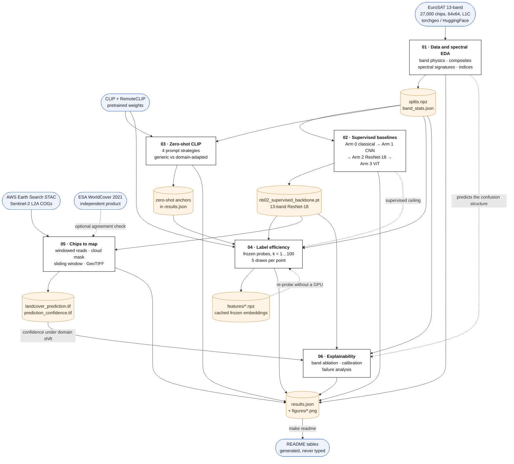

# Sentinel-2: From Chips to Map

**How far can you get on Sentinel-2 land-cover classification *without labels*,
using vision-language models — and how many labels does it actually take to beat
them?**

Six notebooks answer that question end to end. They start with the physics of
what a Sentinel-2 pixel is, build a supervised baseline ladder from spectral
statistics up to a Vision Transformer, test whether CLIP and RemoteCLIP can
classify land cover with no training data at all, measure exactly how many
labels per class it takes to overtake them, and then take the resulting model
out of the curated benchmark and onto a real satellite scene — producing a
georeferenced GeoTIFF, a cloud mask, and an honest account of the domain shift
that degrades it.

> **Status.** The code, tests and notebooks are complete and the pipeline is
> reproducible end to end. The result tables below are generated from
> `outputs/results.json` by `make readme`; where they say "no results recorded
> yet", the notebooks have not been executed in this checkout. **No number in
> this README is typed by hand, and none is reported that was not produced by a
> run.**

---

## The headline figure


Test macro-F1 against labelling budget, log x-axis, ±1 std over five random
label draws per point. Dotted lines are zero-shot (0 labels); the dashed line is
full supervision (18,900 labels). Produced by
[`notebooks/04_fewshot_label_efficiency.ipynb`](notebooks/04_fewshot_label_efficiency.ipynb).

<!-- AUTOGENERATED:label_efficiency -->
_No results recorded yet. Run the notebooks — each one appends to `outputs/results.json` — then `make readme`._
<!-- END:label_efficiency -->

---

## Key results

<!-- AUTOGENERATED:results -->
_No results recorded yet. Run the notebooks — each one appends to `outputs/results.json` — then `make readme`._
<!-- END:results -->

---

## The pipeline

How data actually flows through the project. Rounded boxes are external data
sources, rectangles are notebooks, and the cylinders are files written to disk —
those files are the contract between chapters, which is why the notebooks must
run in order and why a dead Colab session never costs more than one chapter.



Reading it as a story rather than a graph:

1. **EuroSAT in, split out.** Notebook 01 establishes the physics and writes the
   one split and the one set of normalisation statistics that every later chapter
   uses — computed on the training indices only, so nothing downstream leaks.
2. **The ladder.** Notebook 02 climbs from 29 spectral features to a ViT and
   emits the checkpoint that three later notebooks load. Its best score becomes
   the *ceiling* line on the headline figure.
3. **The no-label arm.** Notebook 03 needs no training data at all; it only
   consumes the test split (so its numbers are comparable) and emits the
   zero-shot anchors that appear as dotted lines on the headline figure.
4. **The synthesis.** Notebook 04 freezes four encoders, caches their embeddings
   once, and sweeps the labelling budget — the ceiling from 02 and the anchors
   from 03 are what turn a curve into an answer.
5. **Contact with reality.** Notebook 05 leaves the benchmark entirely: real
   scene, real clouds, real L1C→L2A shift, out to a georeferenced GeoTIFF.
6. **Can you trust it?** Notebook 06 closes the loop — it scores the prediction
   notebook 01 made from spectroscopy alone, and compares confidence in-domain
   against confidence on notebook 05's shifted scene.

The two dotted grey links are the project's argument rather than its data flow:
physics predicts the errors, and the supervised ceiling gives the label-efficiency
curve something to be measured against.

---

## What this project demonstrates

| Notebook                                                                           | Techniques                                                                                                                                                                                                                                                                   |
| ---------------------------------------------------------------------------------- | ---------------------------------------------------------------------------------------------------------------------------------------------------------------------------------------------------------------------------------------------------------------------------- |
| [01 — Data and spectral EDA](notebooks/01_data_and_spectral_eda.ipynb)             | Sentinel-2 band physics, percentile stretching, true/false-colour composites, spectral signatures, NDVI/NDWI/NDBI, stratified splitting, leakage-free normalisation statistics                                                                                               |
| [02 — Supervised baselines](notebooks/02_supervised_baselines.ipynb)               | Classical features + LogReg/RandomForest, small CNN from scratch, ImageNet ResNet-18 with**13-channel stem inflation**, ViT-S/16 with interpolated position embeddings, multi-seed protocol, domain-appropriate augmentation                                           |
| [03 — Zero-shot CLIP](notebooks/03_zeroshot_clip.ipynb)                            | Contrastive vision-language models, zero-shot classification heads, a four-way prompt-engineering study, prompt ensembling, RemoteCLIP domain adaptation, embedding-space projection                                                                                         |
| [04 — Few-shot label efficiency](notebooks/04_fewshot_label_efficiency.ipynb)      | Frozen-feature extraction and caching, linear and k-NN probes, multi-draw few-shot protocol, probe-vs-fine-tuning crossover, the label-efficiency curve                                                                                                                      |
| [05 — Chips to map](notebooks/05_chips_to_map.ipynb)                               | STAC search, windowed Cloud-Optimised GeoTIFF reads, multi-resolution band alignment, SCL cloud masking,**L1C→L2A domain shift**, sliding-window inference with overlap averaging, GeoTIFF output, SAM segment + classifier fusion, ESA WorldCover agreement analysis |
| [06 — Explainability and failures](notebooks/06_explainability_and_failures.ipynb) | Grad-CAM (with its limits stated), causal band-group ablation, reliability diagrams, Expected Calibration Error, temperature scaling, confidence under domain shift, diagnosed failure gallery                                                                               |

---

## From chips to a map


True colour, the classifier's prediction, SAM's semantic-free segments, and the
combination — SAM's boundaries filled with the classifier's majority class. They
fail in complementary ways: SAM knows *where* things are and not *what*; the
classifier knows *what* but only at 320 m boundary resolution.

<!-- AUTOGENERATED:scene -->
_No results recorded yet. Run the notebooks — each one appends to `outputs/results.json` — then `make readme`._
<!-- END:scene -->

---

## Findings

Written as claims once the notebooks have been run; each is backed by a number in
`outputs/results.json` and a figure in `figures/`.

1. **Most of the problem is spectroscopy, not deep learning.** 29 hand-made
   spectral features with every trace of spatial structure discarded land close
   to a pretrained ResNet. Reporting the ResNet number without this baseline
   would misattribute the credit.
2. **Multispectral is worth a measurable amount over RGB**, which is precisely
   the handicap a vision-language model operates under: CLIP sees three of
   thirteen bands, and no prompt can recover the other ten.
3. **In a zero-shot system, the class name is a model parameter.** Rewriting
   CamelCase dataset labels as English moves accuracy substantially with the
   model, the images and the protocol unchanged.
4. **Domain-specific pretraining shows up as label efficiency**, not merely as
   accuracy — its advantage is largest at small k and narrows as labels arrive.
5. **A single 1-shot number is noise.** Draw-to-draw variance at k=1 exceeds the
   gaps between encoders, which is why every point is five draws with a visible
   std band.
6. **The ViT does not beat the ResNet at this scale**, as expected on 19k chips —
   reported as-is rather than tuned until the story improved.
7. **The L1C→L2A shift degrades the real-scene map**, quantified by per-band
   histograms and by the disagreement between two normalisation choices on
   identical pixels. Nothing raises an error; the map just gets worse.

---

## Limitations

Written by the author, not hidden.

- **The split is random, not spatially blocked.** EuroSAT chips are cut from a
  limited set of Sentinel-2 scenes, so nearby chips are spatially
  autocorrelated and a random split leaks information from train into test.
  Every number here is therefore mildly optimistic. The correct fix is a
  spatially blocked split by source scene or region; we keep the random split
  for comparability with published EuroSAT numbers and say so rather than
  quietly benefiting from it.
- **Training data is L1C, the real scene is L2A.** The model is trained on
  top-of-atmosphere reflectance and applied to atmospherically corrected surface
  reflectance. Notebook 05 quantifies and partially mitigates this, but
  re-standardisation is a patch: the proper fix is to train on the processing
  level you deploy on.
- **EuroSAT is small, European, and single-label.** 64×64 chips cover 640 m —
  large enough to contain several land covers, so a single label is sometimes
  simply wrong, and some of the "errors" in notebook 06 are label noise. The
  geographic coverage is Europe only, so nothing here supports a claim about
  cross-continental generalisation.
- **Discarding ten bands to feed CLIP is a fundamental handicap**, not a tuning
  problem. Comparisons against the 13-band supervised model are not
  apples-to-apples; the RGB-only ablation exists for that reason.
- **No temporal dimension.** Every result uses a single acquisition. Land cover
  is seasonal — a bare winter field and a bare fallow field are the same pixels
  and different classes — and time series are where most of the operational
  signal in deforestation monitoring actually lives.
- **10 m resolution bounds the task.** Object detection of cars or individual
  buildings is physically impossible at this GSD; classification, segmentation
  and change detection are the honest tasks.
- **The scene map has no ground truth.** The WorldCover comparison is an
  *agreement* analysis against another model's product, not an accuracy
  evaluation, and the class-scheme mapping between them is lossy.
- **Runtime compromises** are stated in each notebook: 20 epochs rather than 30,
  three seeds for headline arms and one for ablations, subsampled chips for the
  spectral-signature figure.

---

## How to run

**On Colab** (free T4 is sufficient; each notebook checkpoints to disk so a dead
session never costs more than one chapter):

| Notebook                       | Runtime     | Colab                                                                                                                                                                                                    |
| ------------------------------ | ----------- | -------------------------------------------------------------------------------------------------------------------------------------------------------------------------------------------------------- |
| 01 Data and spectral EDA       | ~10 min     | [](https://colab.research.google.com/github/SaadH-077/s2-chips-to-map/blob/main/notebooks/01_data_and_spectral_eda.ipynb)       |
| 02 Supervised baselines        | ~35 min     | [](https://colab.research.google.com/github/SaadH-077/s2-chips-to-map/blob/main/notebooks/02_supervised_baselines.ipynb)        |
| 03 Zero-shot CLIP              | ~20 min     | [](https://colab.research.google.com/github/SaadH-077/s2-chips-to-map/blob/main/notebooks/03_zeroshot_clip.ipynb)               |
| 04 Few-shot label efficiency   | ~30 min     | [](https://colab.research.google.com/github/SaadH-077/s2-chips-to-map/blob/main/notebooks/04_fewshot_label_efficiency.ipynb)    |
| 05 Chips to map                | ~25–40 min | [](https://colab.research.google.com/github/SaadH-077/s2-chips-to-map/blob/main/notebooks/05_chips_to_map.ipynb)                |
| 06 Explainability and failures | ~20 min     | [](https://colab.research.google.com/github/SaadH-077/s2-chips-to-map/blob/main/notebooks/06_explainability_and_failures.ipynb) |

**Run them in order.** The chapters depend on each other's artefacts: 01 writes
the split and normalisation statistics everything else uses, 02 writes the
checkpoint that 04, 05 and 06 load, and 03 writes the zero-shot anchors that 04
plots on the headline figure. Each notebook fails loudly if a prerequisite is
missing rather than silently rebuilding it differently.

**Persistence.** Every notebook's setup cell mounts Google Drive and redirects
`outputs/` and `figures/` to `MyDrive/s2-chips-to-map/`, so a disconnected
session never costs more than the chapter in progress. The EuroSAT cache stays
on the local VM disk: it is ~2.9 GB read randomly every epoch, and Drive is a
network mount where that access pattern would dominate the runtime — a few
minutes of re-download per session is the cheaper trade. Set `USE_DRIVE = False`
in the setup cell to keep everything ephemeral.

Before running, set `GITHUB_USER` in the setup cell to your handle, and select
**Runtime → Change runtime type → T4 GPU** (the setup cell warns if no GPU is
attached).

**Locally:**

```bash
make install       # pinned dependencies
make test          # unit tests: seconds, no GPU, no data download
jupyter lab notebooks/
```

The notebooks import from `src/`; nothing needs installing as a package. Paths,
class names, seeds, hyperparameters and the notebook-05 area of interest all
live in [`configs/default.yaml`](configs/default.yaml) and
[`src/s2map/config.py`](src/s2map/config.py).

---

## Repository layout

```
src/s2map/          all shared logic — notebooks import it, never redefine it
  config.py         paths, class names, seeds, experiment config
  bands.py          Sentinel-2 band table, spectral indices, compositing
  data.py           dataset acquisition with fallbacks, splits, normalisation
  transforms.py     domain-appropriate augmentation
  models.py         model builders + 13-channel stem inflation
  train.py          one training loop for every arm
  evaluate.py       metrics, calibration, the results ledger
  clip_utils.py     prompt strategies, zero-shot heads, RemoteCLIP loading
  stac.py           STAC search, windowed COG reads, cloud masking
  inference.py      sliding-window tiling/stitching, GeoTIFF output
  viz.py            every figure, one consistent style
tests/              49 tests: index maths, split leakage, tiling, metrics
notebooks/          the six chapters
configs/            default.yaml
outputs/            metrics, checkpoints, GeoTIFFs (gitignored except results.json)
figures/            every saved plot at 150 dpi
```

Anything used twice lives in `src/`. That constraint is the difference between a
notebook dump and an engineered project, and the tests exist for the parts where
a silent bug would change the results rather than raise an error: split leakage,
tile stitching, index arithmetic, and the metrics themselves.

```bash
$ make test
49 passed
```

---

## Data sources and licences

- **EuroSAT** — Helber et al., *EuroSAT: A Novel Dataset and Deep Learning
  Benchmark for Land Use and Land Cover Classification*, IEEE JSTARS 2019.
  27,000 labelled 64×64 Sentinel-2 L1C chips, 13 bands, MIT licence.
  [https://github.com/phelber/EuroSAT](https://github.com/phelber/EuroSAT)
- **Copernicus Sentinel-2** — imagery for notebook 05, free and open under the
  Copernicus programme licence, accessed through the AWS Earth Search STAC API
  ([https://earth-search.aws.element84.com/v1](https://earth-search.aws.element84.com/v1), collection `sentinel-2-l2a`,
  no authentication required).
- **ESA WorldCover 2021 v200** — 10 m global land cover, CC-BY 4.0, used only as
  an independent agreement reference. [https://esa-worldcover.org](https://esa-worldcover.org)
- **RemoteCLIP** — checkpoints released by the authors in OpenCLIP format.
  [https://github.com/ChenDelong1999/RemoteCLIP](https://github.com/ChenDelong1999/RemoteCLIP)

No imagery is committed to this repository; everything is downloaded at run time
from the sources above.

---

## References

- Radford et al. (2021), *Learning Transferable Visual Models From Natural
  Language Supervision* (CLIP). arXiv:2103.00020
- Liu et al. (2024), *RemoteCLIP: A Vision Language Foundation Model for Remote
  Sensing*. IEEE TGRS. arXiv:2306.11029
- Kirillov et al. (2023), *Segment Anything*. arXiv:2304.02643
- Helber et al. (2019), *EuroSAT: A Novel Dataset and Deep Learning Benchmark for
  Land Use and Land Cover Classification*. IEEE JSTARS 12(7)
- Guo et al. (2017), *On Calibration of Modern Neural Networks*. ICML
- Selvaraju et al. (2017), *Grad-CAM: Visual Explanations from Deep Networks via
  Gradient-based Localization*. ICCV
- Drusch et al. (2012), *Sentinel-2: ESA's Optical High-Resolution Mission for
  GMES Operational Services*. Remote Sensing of Environment 120

---

MIT licensed. Built by Muhammad Saad Haroon.
