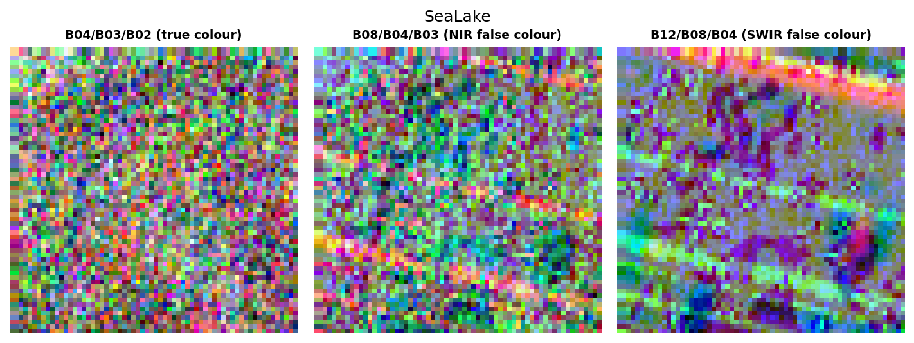
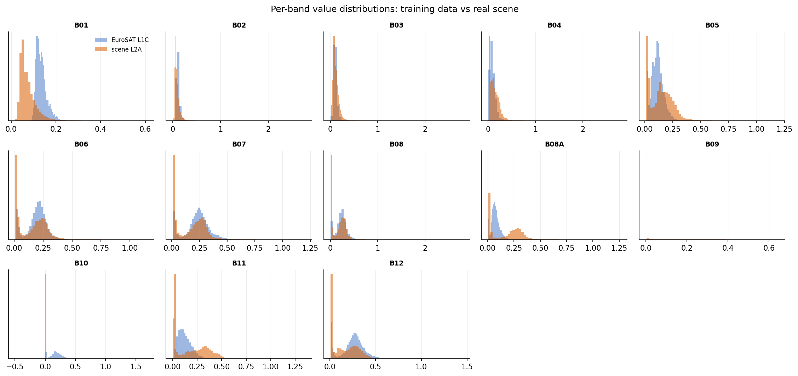
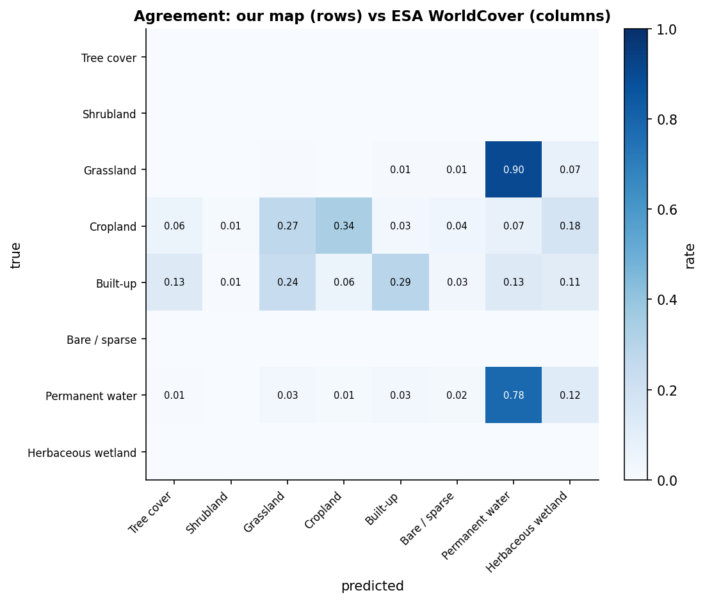
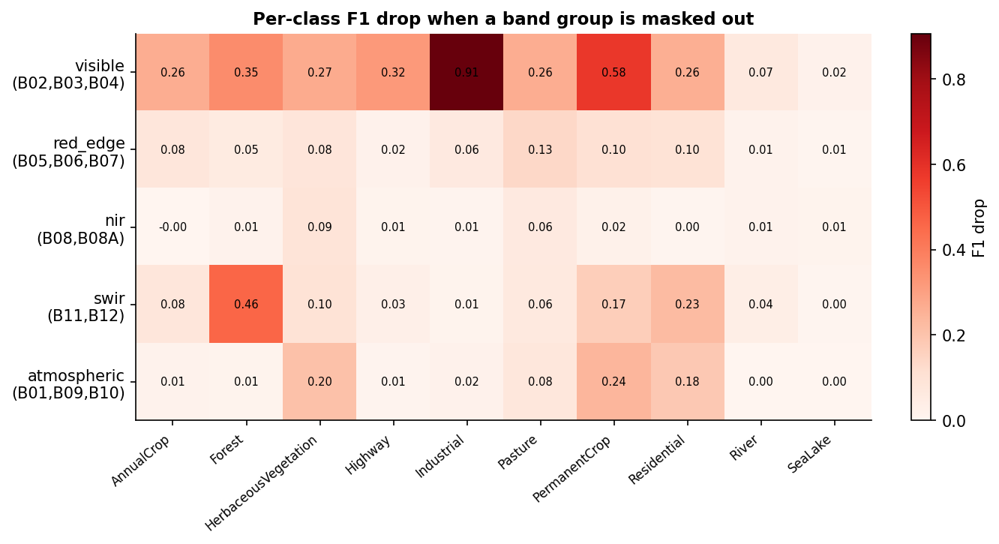
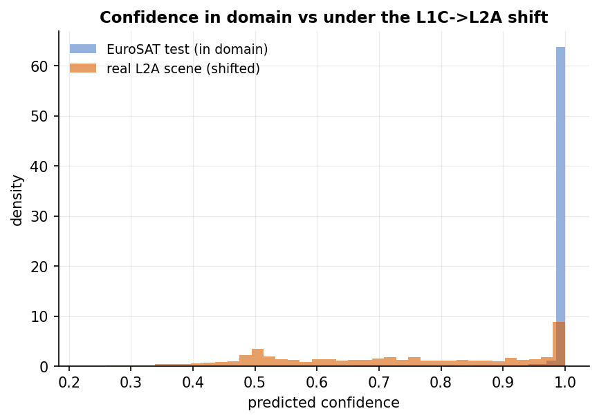
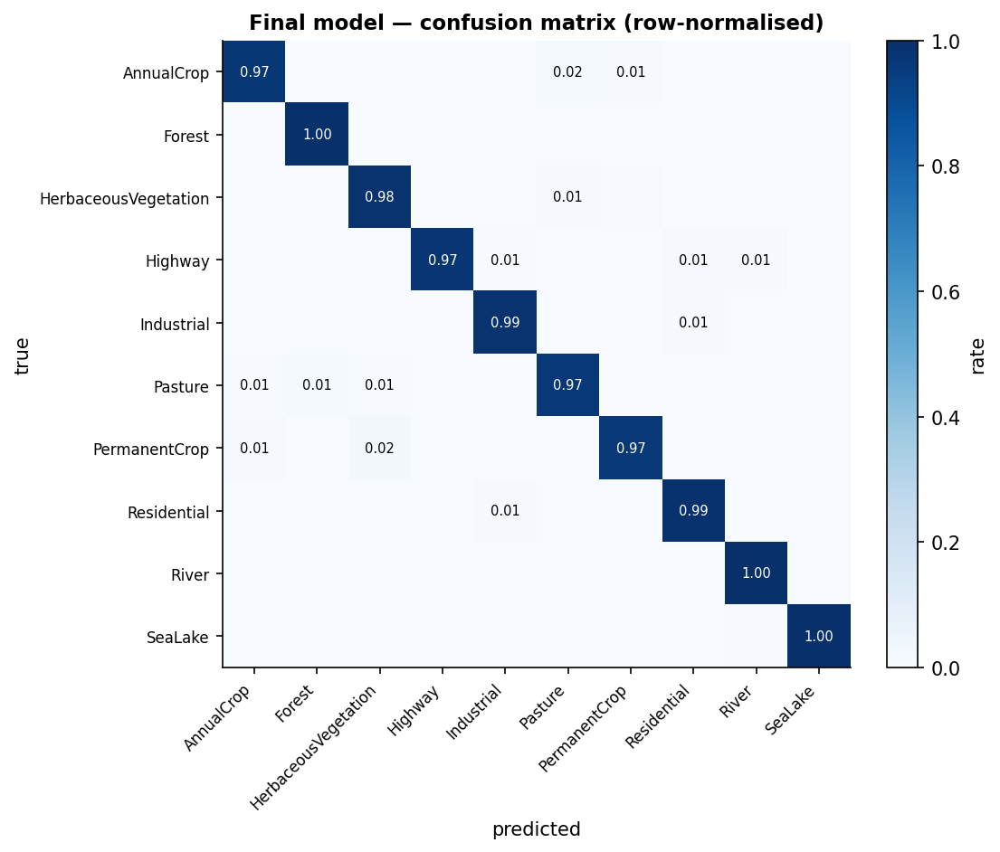
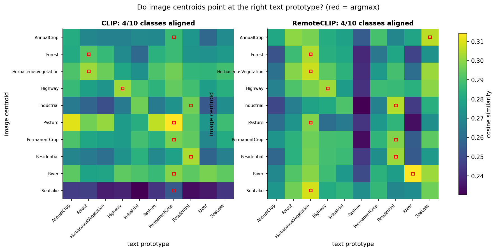
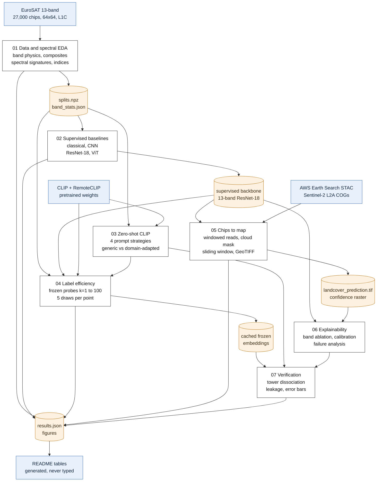

<div align="center">

# Sentinel-2 Land Cover: From Chips to Map

**How far can you classify satellite land cover *without labels* using vision-language models —
and how many labels does it actually take to beat them?**

[](https://www.python.org/)
[](https://pytorch.org/)
[](https://sentinels.copernicus.eu/web/sentinel/missions/sentinel-2)
[](tests/)
[](LICENSE)

A seven-notebook computer-vision study on **27,000 multispectral Sentinel-2 chips**, ending on a
**georeferenced land-cover map of a real scene** — classical baselines, CNNs, ViTs, CLIP & RemoteCLIP,
few-shot label efficiency, SAM, explainability, calibration, and a verification chapter that
stress-tests its own surprising results.


<sub><b>End of the pipeline:</b> a real Sentinel-2 L2A scene over the Bay of Cádiz (2023-08-24, 0.01% cloud) →
sliding-window inference → a georeferenced GeoTIFF you can open in QGIS. Left: true colour. Middle: predicted
land cover. Right: cloud/shadow mask.</sub>

</div>

---

## TL;DR — the five numbers

| | |
|---|---|
| **0.984** macro-F1 | full supervision, 13-band ResNet-18, 18,900 labels *(3 seeds)* |
| **0.359** macro-F1 | best zero-shot CLIP — no labels at all, **10 of 13 bands discarded** |
| **1 label per class** | is already enough for a linear probe to beat zero-shot CLIP |
| **0.891** macro-F1 | 29 hand-made spectral statistics + a Random Forest, **no deep learning** |
| **−0.021** macro-F1 | the cost of removing train/test leakage via a scene-blocked split |

> **The one sentence.** *A single labelled example per class beats zero-shot CLIP; 100 labels per class —
> 5% of the training set — gets you within 5 points of full supervision; and 89% of the problem is solved
> by spectral statistics alone, before any deep learning at all.*

---

## The headline figure

<div align="center">

</div>

Test macro-F1 against labelling budget (log x), ±1 std over **5 random label draws per point**. Dotted lines
are zero-shot (0 labels); the dashed line is full supervision (18,900 labels). The k=1 error bars are wider
than the gaps between encoders — which is exactly why a single 1-shot number is not a result.

<!-- AUTOGENERATED:label_efficiency -->
| Frozen encoder | k=1 | k=2 | k=5 | k=10 | k=20 | k=50 | k=100 |
|---|---|---|---|---|---|---|---|
| CLIP ViT-B/32 | 0.444 ± 0.056 | 0.548 ± 0.061 | 0.692 ± 0.033 | 0.784 ± 0.015 | 0.833 ± 0.010 | 0.876 ± 0.006 | 0.900 ± 0.001 |
| RemoteCLIP ViT-B/32 | 0.479 ± 0.056 | 0.612 ± 0.045 | 0.749 ± 0.015 | 0.825 ± 0.013 | 0.857 ± 0.004 | 0.891 ± 0.003 | 0.913 ± 0.004 |
| ImageNet ResNet-18 | 0.543 ± 0.037 | 0.604 ± 0.074 | 0.754 ± 0.020 | 0.826 ± 0.019 | 0.858 ± 0.004 | 0.893 ± 0.005 | 0.909 ± 0.001 |
| NB02 supervised 13-band *(reference — saw all labels)* | 0.982 ± 0.001 | 0.983 ± 0.001 | 0.985 ± 0.001 | 0.984 ± 0.001 | 0.984 ± 0.001 | 0.984 ± 0.001 | 0.984 ± 0.000 |
| Fine-tuned ResNet-18 (RGB) | 0.642 ± 0.005 | 0.848 ± 0.010 | 0.931 ± 0.004 |

Full-supervision ceiling (all 18,900 training labels): **0.984** macro-F1.  
CLIP zero-shot (0 labels): **0.335** macro-F1.  
RemoteCLIP zero-shot (0 labels): **0.187** macro-F1.  
Fine-tuning overtakes every frozen probe at roughly **k = 100** labels per class.
<!-- END:label_efficiency -->

---

## What the data actually looks like

Satellite imagery is not a picture — every pixel is thirteen calibrated measurements of reflected light.
The project starts there, because the physics predicts the model's errors before any model exists.

<table>
<tr>
<td width="50%"></td>
<td width="50%"><br/>
</td>
</tr>
<tr>
<td><sub><b>The ten classes</b> in true colour (B04/B03/B02) after a 2–98% percentile stretch. Without that
stretch every one of these renders near-black — land reflectance occupies a small, low slice of the sensor's
range.</sub></td>
<td><sub><b>The same chip, three ways.</b> True colour, NIR false colour (vegetation glows red — chlorophyll
absorbs red, leaf mesophyll scatters near-infrared), and SWIR (moisture and bare ground). This is what the
10 discarded bands are worth.</sub></td>
</tr>
</table>

<div align="center">

</div>

<sub><b>The key figure of chapter 01.</b> Mean reflectance per band, per class. Three families are visible: the
vegetation classes share a "red edge" (dip at B04, jump at B08) and differ only in amplitude; water collapses
to near-zero past 900 nm; built-up surfaces are flat and bright. **From this alone we predicted that the
vegetation classes would dominate the confusion matrix — and they do, at 54% of the top-10 confusion mass.**</sub>

---

## Do the classes separate in a vision-language embedding space?

<div align="center">

</div>

<sub>UMAP of frozen image embeddings for 3,000 test chips, coloured by true class. The clusters are far cleaner
than the zero-shot accuracy (0.36 / 0.22) suggests — which is the whole motivation for the linear probes in
chapter 04. <b>The representation is good; the text prototypes are what fail.</b> Chapter 07 proves that
directly.</sub>

---

## Chips → map: does any of it survive a real scene?

<div align="center">

</div>

<sub><b>Two models that fail in complementary ways.</b> The chip classifier produces semantics with boundaries
quantised to the 64×64 tile grid; SAM produces crisp, object-aligned segments with no idea what any of them
are. Filling each SAM segment with the classifier's majority class gives crisp boundaries <i>and</i> labels —
no training, no new model.</sub>

<table>
<tr>
<td width="50%"></td>
<td width="50%"></td>
</tr>
<tr>
<td><sub><b>The domain shift, measured.</b> EuroSAT is Level-1C (top-of-atmosphere); the scene is Level-2A
(surface reflectance). Same units, different distributions. The two defensible normalisation choices disagree
on <b>65.1% of pixels</b> — identical weights, identical pixels.</sub></td>
<td><sub><b>An agreement analysis, not an accuracy one.</b> ESA WorldCover is another model's product, not
ground truth. 42.8% agreement after a deliberately lossy class mapping (three built-up classes collapse into
one) — and the AOI contains salt marsh, which has no EuroSAT class at all.</sub></td>
</tr>
</table>

<!-- AUTOGENERATED:scene -->
Scene: `S2B_29SQA_20230824_0_L2A` over Bay of Cadiz, Spain, 2023-08-24, 0.009914% cloud.

| Class | Predicted area (ha) |
|---|---|
| AnnualCrop | 1,564 |
| Forest | 0 |
| HerbaceousVegetation | 410 |
| Highway | 546 |
| Industrial | 1,775 |
| Pasture | 3,215 |
| PermanentCrop | 3,123 |
| Residential | 6,724 |
| River | 4,452 |
| SeaLake | 4,700 |
| _nodata | 3 |

The two normalisation choices (training statistics vs scene statistics) disagree on **65.1%** of valid pixels — identical weights, identical pixels, different preprocessing. That is the L1C→L2A domain shift, measured.
<!-- END:scene -->

---

## Can the model be trusted? Explainability, calibration, failure

<table>
<tr>
<td width="50%"></td>
<td width="50%"></td>
</tr>
<tr>
<td><sub><b>Band ablation beats Grad-CAM here.</b> At 64×64 the final conv map is 2×2, so a CAM is upsampled
from four values — we say so rather than over-claiming. Masking band groups is causal and interpretable:
visible −0.330, SWIR −0.118, <b>atmospheric −0.076</b>, red-edge −0.064, NIR −0.023.</sub></td>
<td><sub><b>Confidence collapses out of domain — as it should.</b> 0.991 mean confidence on benchmark chips
(97.3% above 0.9) versus 0.729 on the real scene (29.1% above 0.9). A benchmark-tuned review threshold would
be meaningless on production imagery.</sub></td>
</tr>
<tr>
<td width="50%"></td>
<td width="50%"></td>
</tr>
<tr>
<td><sub><b>The 20 most confidently wrong predictions.</b> Nearly all are vegetation-vs-vegetation at ≥0.98
confidence. A 64×64 chip covers 640 m and often contains several land covers, so a share of these are label
noise rather than model error — and diagnosing that is the judgement the job is actually for.</sub></td>
<td><sub><b>The loop, closed.</b> Chapter 01 predicted the error structure from spectroscopy alone. 54% of the
top-10 confusion mass is vegetation-internal, water scores 0.998/0.989 — two predictions confirmed, one
(linear features suffer) refuted.</sub></td>
</tr>
</table>

---

## Results

<!-- AUTOGENERATED:results -->
| Notebook | Arm | Input | Test accuracy | Test macro-F1 | Params | Notes |
|---|---|---|---|---|---|---|
| 02 | arm0_logreg | 29 spectral features | 0.886 | 0.882 | 0.00M | no spatial information at all |
| 02 | arm0_random_forest | 29 spectral features | 0.896 | 0.891 | — | 400 trees |
| 02 | arm1_small_cnn | 13-band | 0.971 ± 0.002 | 0.970 ± 0.002 | 0.25M | trained from scratch |
| 02 | arm2_resnet18_13band | 13-band | 0.985 ± 0.002 | 0.984 ± 0.002 | 11.21M | ImageNet stem inflated to 13 channels |
| 02 | arm2_resnet18_randomstem | 13-band | — | 0.983 ± 0.001 | — | 3 seeds (NB07) — pretrained stem discarded |
| 02 | arm2_resnet18_rgb | RGB only | — | 0.979 ± 0.001 | — | 3 seeds (NB07) — supersedes the NB02 single-seed run |
| 02 | arm3_vit_small | 13-band | 0.981 ± 0.001 | 0.980 ± 0.001 | — | ViT-S/16 at 64px, interpolated position embeddings |
| 03 | clip_vitb32_v1_raw_labels | RGB only (10 of 13 bands discarded) | 0.296 | 0.247 | — | zero-shot, prompt strategy v1_raw_labels |
| 03 | clip_vitb32_v2_simple_template | RGB only (10 of 13 bands discarded) | 0.360 | 0.324 | — | zero-shot, prompt strategy v2_simple_template |
| 03 | clip_vitb32_v3_natural_names | RGB only (10 of 13 bands discarded) | 0.299 | 0.251 | — | zero-shot, prompt strategy v3_natural_names |
| 03 | clip_vitb32_v4_prompt_ensemble | RGB only (10 of 13 bands discarded) | 0.387 | 0.335 | — | zero-shot, prompt strategy v4_prompt_ensemble |
| 03 | remoteclip_vitb32 | RGB only (10 of 13 bands discarded) | 0.263 | 0.187 | — | zero-shot, v4_prompt_ensemble; loaded from chendelong/RemoteCLIP; missing keys: 0 |
<!-- END:results -->

<sub>Every number above is read from `outputs/results.json` by `make readme`. Nothing in this README is typed
by hand, and nothing is reported that was not produced by a run.</sub>

---

## Findings

**1. Most of the problem is spectroscopy, not deep learning.** 29 hand-made spectral statistics with *all*
spatial structure discarded reach **0.891** macro-F1. The entire deep-learning stack buys **+9.5 points** on
top of that. Reporting 0.984 without this baseline would misattribute the credit.

**2. Zero-shot vision-language models are weak on 10 m multispectral imagery — 0.359 macro-F1 at best,**
against a 0.978 RGB-supervised ceiling. CLIP only ever sees a percentile-stretched RGB rendering: **ten of
thirteen bands are discarded**, including every band the spectral analysis showed carries the separability.
This is structural, not a tuning problem.

**3. RemoteCLIP has *better features* and *worse language alignment* than generic CLIP — the project's
sharpest result.** Domain-specific pretraining looked like a failure (zero-shot **0.224** vs CLIP's 0.359)
and simultaneously like a success (best frozen probe at every budget). Chapter 07 separated the two towers by
replacing text prototypes with image class-means in the same embedding space:

| | RemoteCLIP − CLIP |
|---|---|
| **Text** prototypes (zero-shot) | **−0.135** |
| **Image** prototypes (20 labels/class) | **+0.080** |

Opposite signs. The encoder improved; the text alignment degraded. Verified not to be a prompting artefact —
the gap is +0.135 even when *each model uses its own best prompt strategy*.

**4. Prompt wording is a real design parameter, and "nicer English" is not automatically better.** Completing
the wording × ensembling 2×2 factorial showed an **interaction**: for CLIP, natural class names *hurt* with a
single template (−0.062) but help slightly under ensembling (+0.008). CLIP's best strategy turned out to be
raw CamelCase labels *with* ensembling (0.359) — not the natural names we assumed would win.

**5. One labelled example per class beats zero-shot.** Every frozen encoder at k=1 (0.44–0.54) exceeds
zero-shot CLIP (0.359). Frozen probes beat fine-tuning at k=5 and k=20; **fine-tuning overtakes at k=100**
(0.931 vs 0.913). Below the crossover, 11M parameters on 50 examples simply overfits.

**6. The multispectral and pretrained-stem advantages do not survive error bars.** Re-run at 3 seeds:
13-band 0.9837±0.0023, RGB-only 0.9788±0.0009 (Δ+0.0049), random stem 0.9827±0.0008 (Δ+0.0011). Against
pooled seed noise, **neither delta clears a 2σ bar.** The honest conclusion is that at 18,900 labels the model
has enough data to relearn a stem and to compensate for the missing bands — not that multispectral is
worthless.

**7. The random split leaks, and we measured it.** EuroSAT ships no scene IDs, so chapter 07 clustered chips
by *atmospheric* band statistics (B01/B09/B10 — channels carrying almost no surface information) as a
pseudo-scene proxy and held whole clusters out. Macro-F1 falls **0.985 → 0.964**. Corroborating evidence: land
cover is predictable from those atmospheric bands alone at **67.7%** accuracy (chance 10%), and masking them
costs more F1 than masking NIR. The model is partly recognising *when and under what sky* a chip was acquired.

**8. Calibration is mild in-domain and irrelevant out of it.** Temperature scaling (T=1.224, fitted on
validation) cuts ECE from 0.0074 to 0.0041 without changing a single prediction. But under the L1C→L2A shift
confidence drops to 0.729 — so a threshold tuned on the benchmark does not transfer.

---

## Verification — chapter 07

Three of the results above contradicted the expectations this project was built on, so they got their own
chapter rather than a caveat:

| Question | Answer |
|---|---|
| Was RemoteCLIP's deficit just prompt transfer? | **No** — +0.135 gap persists with per-model best prompts |
| Are its features bad, or its text prototypes? | **Text prototypes** — features are *better* (+0.080) |
| Are the wording/ensembling effects separable? | **No** — they interact (+0.070 for CLIP) |
| Does the random split leak? | **Yes** — −0.021 macro-F1 under a scene-blocked split |
| Do the NB02 ablations survive seeds? | **No** — both deltas fall inside pooled seed noise |

<div align="center">

</div>

<sub>For each model: does a class's image centroid point at its own text prototype? Only **4/10** classes
align, for both models. CLIP's ten class text embeddings have mean pairwise cosine similarity **0.880** — they
are crowded into nearly the same direction, so the argmax is decided by tiny differences. That is the
mechanism behind a zero-shot confusion matrix that collapses onto a single class.</sub>

---

## The pipeline



The cylinders are the contract between chapters: chapter 01 writes the one split every other chapter uses,
02 writes the checkpoint that 04/05/06 load, 03 writes the zero-shot anchors that 04 plots. That is why the
notebooks run in order — and why a dead Colab session never costs more than one chapter.

---

## What each notebook demonstrates

| # | Notebook | Techniques |
|---|---|---|
| 01 | [Data & spectral EDA](notebooks/01_data_and_spectral_eda.ipynb) | Sentinel-2 band physics, percentile stretching, true/false-colour composites, spectral signatures, NDVI/NDWI/NDBI, stratified splitting, leakage-free normalisation |
| 02 | [Supervised baselines](notebooks/02_supervised_baselines.ipynb) | Classical features + LogReg/RF, small CNN, ImageNet ResNet-18 with **13-channel stem inflation**, ViT-S/16 with interpolated position embeddings, multi-seed protocol, domain-specific augmentation |
| 03 | [Zero-shot CLIP](notebooks/03_zeroshot_clip.ipynb) | Contrastive VLMs, zero-shot heads, prompt-engineering study, prompt ensembling, RemoteCLIP, UMAP embedding analysis |
| 04 | [Label efficiency](notebooks/04_fewshot_label_efficiency.ipynb) | Frozen-feature caching, linear & k-NN probes, multi-draw few-shot protocol, probe-vs-fine-tuning crossover |
| 05 | [Chips to map](notebooks/05_chips_to_map.ipynb) | STAC search, windowed COG reads, multi-resolution band alignment, SCL cloud masking, **L1C→L2A domain shift**, sliding-window inference, GeoTIFF output, SAM fusion, WorldCover agreement |
| 06 | [Explainability](notebooks/06_explainability_and_failures.ipynb) | Grad-CAM (with its limits), causal band ablation, reliability diagrams, ECE, temperature scaling, confidence under shift |
| 07 | [Verification](notebooks/07_verification_and_ablations.ipynb) | 2×2 prompt factorial, image-vs-text tower dissociation, embedding geometry, scene-blocked split, multi-seed error bars |

---

## Limitations

Written by the author, not hidden.

- **The random split leaks — now quantified.** Chapter 07 measures −0.021 macro-F1 under a scene-blocked
  split. That figure is an *upper bound*: the blocked split also imposes an illumination shift and a badly
  imbalanced test set (Forest 0.5%, Industrial 25%). The proper fix is a geographically blocked split, which
  EuroSAT's metadata does not permit.
- **Training data is L1C, the deployed scene is L2A.** Re-standardising with scene statistics patches a global
  offset; it cannot fix a change in distribution *shape*. The real fix is to train on the processing level you
  deploy on.
- **EuroSAT is small, European and single-label.** 64×64 chips cover 640 m and routinely contain several land
  covers, so a share of chapter 06's "errors" are label noise. Nothing here supports a cross-continental
  generalisation claim.
- **Discarding 10 of 13 bands to feed CLIP is a fundamental handicap**, not a tuning problem. The RGB-only
  supervised arm exists to make that comparison fair.
- **No temporal dimension.** Every result uses a single acquisition. Land cover is seasonal, and time series
  are where most of the operational signal in deforestation monitoring lives.
- **10 m resolution bounds the task.** Detecting cars or individual buildings is physically impossible at this
  GSD; classification, segmentation and change detection are the honest tasks.
- **The scene map has no ground truth.** The WorldCover comparison is an agreement analysis, and the class
  mapping between the two schemes is lossy by construction.
- **Prompt strategy was selected on test** (inherited from chapter 03) — which is why every strategy is
  reported, not just the winner.
- **Runtime compromises** are stated in each notebook: 20 epochs rather than 30, 3 seeds for headline arms,
  subsampling for the spectral-signature figure.

---

## Run it

All seven notebooks run top to bottom on a **free Colab T4**. Each checkpoints to Google Drive, so a dead
session never costs more than one chapter.

| # | Notebook | Runtime | |
|---|---|---|---|
| 01 | Data & spectral EDA | ~10 min *(CPU is fine)* | [](https://colab.research.google.com/github/SaadH-077/sentinel2-landcover-mapping/blob/main/notebooks/01_data_and_spectral_eda.ipynb) |
| 02 | Supervised baselines | ~35 min | [](https://colab.research.google.com/github/SaadH-077/sentinel2-landcover-mapping/blob/main/notebooks/02_supervised_baselines.ipynb) |
| 03 | Zero-shot CLIP | ~20 min | [](https://colab.research.google.com/github/SaadH-077/sentinel2-landcover-mapping/blob/main/notebooks/03_zeroshot_clip.ipynb) |
| 04 | Label efficiency | ~30 min | [](https://colab.research.google.com/github/SaadH-077/sentinel2-landcover-mapping/blob/main/notebooks/04_fewshot_label_efficiency.ipynb) |
| 05 | Chips to map | ~40 min | [](https://colab.research.google.com/github/SaadH-077/sentinel2-landcover-mapping/blob/main/notebooks/05_chips_to_map.ipynb) |
| 06 | Explainability | ~20 min | [](https://colab.research.google.com/github/SaadH-077/sentinel2-landcover-mapping/blob/main/notebooks/06_explainability_and_failures.ipynb) |
| 07 | Verification | ~50 min | [](https://colab.research.google.com/github/SaadH-077/sentinel2-landcover-mapping/blob/main/notebooks/07_verification_and_ablations.ipynb) |

Run them in order — later chapters load earlier chapters' artefacts and fail loudly if one is missing.

```bash
make install    # pinned dependencies
make test       # 60 tests, seconds, no GPU or data download needed
make readme     # regenerate the result tables from outputs/results.json
```

---

## Engineering

```
src/s2map/     all shared logic — notebooks import it, never redefine it
  bands.py       band table, spectral indices, compositing, band-order verification
  data.py        dataset acquisition with documented fallbacks, splits, normalisation
  models.py      model builders, 13-channel stem inflation, Grad-CAM, band masking
  train.py       one training loop for every arm (AdamW, cosine+warmup, AMP, early stopping)
  evaluate.py    metrics, calibration, temperature scaling, the results ledger
  clip_utils.py  prompt strategies, zero-shot heads, RemoteCLIP loading
  stac.py        STAC search, windowed COG reads, cloud masking
  inference.py   sliding-window tiling/stitching, GeoTIFF output, SAM fusion
  viz.py         every figure, one consistent style
tests/         60 tests: split leakage, tile stitching, index maths, metrics, hooks
```

The tests target the failures that would **change the results without raising an error**: train/test overlap,
tile-stitching seams, band-order permutation, autograd being globally disabled by a frozen encoder, and
Grad-CAM hooks that silently substitute tensors.

---

## Data & credits

- **EuroSAT** — Helber et al., IEEE JSTARS 2019. 27,000 labelled Sentinel-2 L1C chips, 13 bands, MIT.
- **Copernicus Sentinel-2** — free and open, via the [AWS Earth Search STAC API](https://earth-search.aws.element84.com/v1).
- **ESA WorldCover 2021 v200** — 10 m global land cover, CC-BY 4.0.
- **RemoteCLIP** — [Liu et al., IEEE TGRS 2024](https://github.com/ChenDelong1999/RemoteCLIP), OpenCLIP-format weights.
- **SAM** — Kirillov et al., ICCV 2023, via [segment-geospatial](https://github.com/opengeos/segment-geospatial).

No imagery is committed to this repository; everything is downloaded at run time.

**References:** CLIP (Radford et al., 2021) · RemoteCLIP (Liu et al., 2024) · SAM (Kirillov et al., 2023) ·
EuroSAT (Helber et al., 2019) · Calibration (Guo et al., 2017) · Grad-CAM (Selvaraju et al., 2017) ·
Sentinel-2 (Drusch et al., 2012)

<div align="center">
<sub>MIT licensed · Built by <b>Muhammad Saad Haroon</b></sub>
</div>
